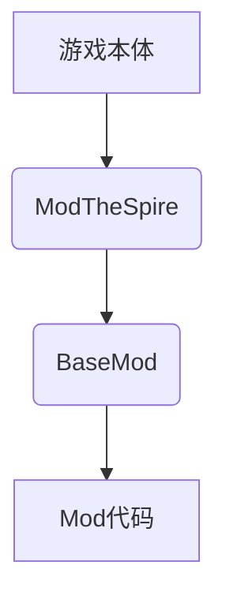

# 杀戮尖塔MOD入门教程 


<!-- @import "[TOC]" {cmd="toc" depthFrom=1 depthTo=6 orderedList=false} -->

<!-- code_chunk_output -->

- [杀戮尖塔MOD入门教程](#杀戮尖塔mod入门教程)
  - [简介](#简介)
  - [准备工作](#准备工作)
    - [游戏本体安装](#游戏本体安装)
    - [下载必要的mod支持库](#下载必要的mod支持库)
    - [搭建mod开发环境](#搭建mod开发环境)
      - [IDE的安装](#ide的安装)
      - [maven环境配置](#maven环境配置)
  - [开始构建项目](#开始构建项目)
    - [构建步骤](#构建步骤)
    - [测试构建效果](#测试构建效果)
    - [作业](#作业)
- [Mod开发语法基础](#mod开发语法基础)

<!-- /code_chunk_output -->

## 简介
杀戮尖塔的MOD都需要modthespire,stslib和basemod这三大支持库来支持，杀戮尖塔mod的本质是在游戏本体中通过第三方API [^1]来添加自己的代码

[^1]: 应用程序接口，提供了代码抽象功能。



*图1 杀戮尖塔mod结构*

杀戮尖塔本体是由java语言构建的，构建方式属于典型的面向对象式的。具体而言就是将众多方法分类封装，然后在程序需要的时候调用。对此，mod代码也可以仿照杀戮尖塔的本体结构来搭建。


*图2 杀戮尖塔游戏本体代码结构*

## 准备工作

### 游戏本体安装

（略）

### 下载必要的mod支持库

1. 在杀戮尖塔的steam页面中找到创意工坊（有条件的同学可以科学上网，也可使用第三方steam加速器）
2. 搜索stslib，basemod，以及modthespire。或是在右侧菜单勾选api寻找这三项。
3. 点击订阅即可。
   
   以上也是想要测试以及游玩其他人提供的mod的先决条件。

### 搭建mod开发环境

#### IDE的安装

杀戮尖塔由java语言编写，为了搭建mod这种大型java工程，我们可以使用IDE（集成开发环境）。目前主流的java IDE[^2]有[Eclipse](https://www.eclipse.org/downloads/)和[Intelij idea](https://www.jetbrains.com/zh-cn/idea/)。本教程后面将以IJ作为示例进行讲解。  
这两种IDE可以在官网上下载，其中Eclipse和Intelij的社区版都是免费的，可以直接使用。点击上文中的超链接即可在官网进行下载并安装。

[^2]: 集成开发环境，除了文中介绍的关于java的IDE。还常用visual studio或者xcode用于开发。


#### maven环境配置

[maven](http://maven.apache.org/download.cgi)是一款程序框架搭建平台，使用它就可以搭建类似于杀戮尖塔这样结构的java程序。  下面讲解下windows环境的配置方法。其他操作系统的配置方法可参考[此处](https://www.runoob.com/maven/maven-setup.html)。
首先通过超链接下载最新版本maven，然后在系统中设置环境变量如下：
1. 找到 计算机-属性-高级系统设置 ，点击环境变量。
2. 新建系统变量 **MAVEN_HOME** ，设置变量值：```E:\Maven\apache-maven-3.3.9```（若已存在则可跳过此步）
3. 寻找系统变量 **Path** ，选择编辑，之后选择新建，写入```;%MAVEN_HOME%\bin```


## 开始构建项目

### 构建步骤

至此我们完成了开发环境的配置，可以进行mod的开发工作了。下面以IJ为例来介绍如何构建一个项目：
1. 打开ij，新建一个maven项目，不勾选选择框。随后填写项目名和文件地址。(本项目取名为tutorial作为示例)

2. 进去之后如下编辑pom.xml：

```xml{.line-numbers}
<?xml version="1.0" encoding="UTF-8"?>
<project xmlns="http://maven.apache.org/POM/4.0.0"
         xmlns:xsi="http://www.w3.org/2001/XMLSchema-instance"
         xsi:schemaLocation="http://maven.apache.org/POM/4.0.0 http://maven.apache.org/xsd/maven-4.0.0.xsd">
    <modelVersion>4.0.0</modelVersion>

    <groupId>org.example</groupId>
    <artifactId>tutorial</artifactId>
    <version>0.1</version>
    <packaging>jar</packaging>

    <name>tutorialMod</name>
    <description>tutorial</description>

    <properties>
        <project.build.sourceEncoding>UTF-8</project.build.sourceEncoding>
        <steam.path>E:\SteamLibrary\steamapps</steam.path>
    </properties>

    <dependencies>
        <dependency>
            <groupId>bin</groupId>
            <artifactId>BaseMod</artifactId>
            <scope>system</scope>
            <version>1.0</version>
            <systemPath>${steam.path}/workshop/content/646570/1605833019/BaseMod.jar</systemPath>
        </dependency>
        <dependency>
            <groupId>bin</groupId>
            <artifactId>SlayTheSpire</artifactId>
            <scope>system</scope>
            <version>1.0</version>
            <systemPath>${steam.path}/common/SlayTheSpire/desktop-1.0.jar</systemPath>
        </dependency>
        <dependency>
            <groupId>bin</groupId>
            <artifactId>ModTheSpire</artifactId>
            <scope>system</scope>
            <version>1.0</version>
            <systemPath>${steam.path}/workshop/content/646570/1605060445/ModTheSpire.jar</systemPath>
        </dependency>
    </dependencies>

    <build>
        <finalName>tutorialMod</finalName>
        <plugins>
            <plugin>
                <groupId>org.apache.maven.plugins</groupId>
                <artifactId>maven-compiler-plugin</artifactId>
                <version>3.7.0</version>
                <configuration>
                    <source>1.8</source>
                    <target>1.8</target>
                </configuration>
            </plugin>
            <plugin>
                <groupId>org.apache.maven.plugins</groupId>
                <artifactId>maven-antrun-plugin</artifactId>
                <version>1.8</version>
                <executions>
                    <execution>
                        <phase>package</phase>
                        <configuration>
                            <target>
                                <copy file="target/tutorialMod.jar" tofile="${steam.path}/common/SlayTheSpire/mods/tutorialMod.jar"/>
                            </target>
                        </configuration>
                        <goals>
                            <goal>run</goal>
                        </goals>
                    </execution>
                </executions>
            </plugin>
        </plugins>
    </build>
</project>
```

在输入完代码后右下角会显示maven配置发生更改，此时选择import Changes即可。这段代码是maven的配置信息，其中包含了以下关键点：

- 这段代码的意思向指定目标文件夹输出编译好的jar文件，jar文件是代码包，也是所有mod的使用格式。在游玩时mod加载器会加载代码包中的文件，或者使用代码包中的代码覆盖游戏代码。version指的是版本控制中的版本号。

- properties项中规定了该文件的编码方式为UTF-8，这种编码方式允许我们使用中文定义变量，也保证了输出代码的准确性。steam/path中是steam游戏所在的文件夹，可根据steamlibrary文件夹的位置修改。

- dependencies加载了三个我们所需要的代码包，也就是上文所介绍的游戏主文件```desktop-1.0.jar```,和两个支持包```BaseMod.jar``` ```ModTheSpire.jar```

- build部分是关于jar的编译输出的，这里提示了maven的运作规律，会先生成测试文件夹，然后再将测试文件夹生成的文件拷贝到目标文件夹。

3. 此时可以看出文件的组织结构如下：

其中： 
    - .idea文件夹是IDE的辅助文件，与mod本身无关。
    - src是程序的主体部分，分成main和test两部分，其中test是maven自动生成的测试文件夹，maven会自动处理好相关细节。最重要的是main文件夹，java是我们存放代码的地方，而resource文件夹用于存放角色或卡面等图片或json格式的文字素材。  

这时我们可以在resource目录下写入```ModTheSpire.json```[^3]，该文件向ModTheSpire标识了该Mod的加载信息，格式如下：
[^3]:右键resource目录，选择New-file，将新建文件改名为ModTheSpire.json并编辑即可。

```json{.line-numbers}
{
  "modid": "totuiral",
  "name": "totuiralMod",
  "author_list": ["A","B"],
  "description": "新手教程mod",
  "version": "0.0.1",
  "sts_version": "03-29-2018",
  "mts_version": "2.6.0",
  "dependencies": ["basemod"]
}
```
Json文件中用花括号{}代表代码块，方括号[]代表数组，要注意他们的配对。这样我们就完成了mod初期的搭建工作。

### 测试构建效果

构建框架的目的是为了输出mod文件，格式为jar。为此我们要进行maven的package操作来测试搭建效果：

    点击右边的maven侧边，展开Lifecycle，这个指的是程序在输出执行的步骤。我们在这些步骤中双击package即可像杀戮尖塔的mod文件夹输出jar格式的mod。也可以点击上面的m按钮，在其中输入```mvn package```。

如果输出成功后，在steam中用withmod模式打开杀戮尖塔，即可在ModTheSpire画面中看到你刚才输出的文件中的标识信息。


在界面中我们勾选Basemod和ModTheSpire，以及刚刚输出的mod（toturialMod），然后选择运行就可以进入游戏。


游戏中进入mod菜单，我们可以看到我们写下的标识信息，但是因为没有写任何代码，这个mod暂时还没有任何功能。
### 作业
1. 仿照上文的方式，输出一个jar格式的mod文件并在游戏中运行。给mod取一个名字，并在作者（Author）一栏写上你的ID。
2. 研读加载mod时ModTheSpire的log框中的信息，尝试揣测他们是什么意思。

# Mod开发语法基础

施工中
