# 杀戮尖塔MOD入门教程 


<!-- @import "[TOC]" {cmd="toc" depthFrom=1 depthTo=6 orderedList=false} -->

<!-- code_chunk_output -->

- [杀戮尖塔MOD入门教程](#杀戮尖塔mod入门教程)
  - [简介](#简介)
  - [准备工作](#准备工作)
    - [游戏本体安装](#游戏本体安装)
    - [下载必要的mod支持库](#下载必要的mod支持库)
    - [搭建mod开发环境](#搭建mod开发环境)
      - [IDE的安装](#ide的安装)
      - [maven环境配置](#maven环境配置)
  - [开始构建项目](#开始构建项目)
    - [构建步骤](#构建步骤)
    - [测试构建效果](#测试构建效果)
    - [作业1](#作业1)
  - [Mod语法基础](#mod语法基础)
    - [创建新mod](#创建新mod)
    - [控制台输出](#控制台输出)
    - [函数基础](#函数基础)
      - [变量](#变量)
      - [函数](#函数)
      - [类](#类)
      - [作用域](#作用域)
    - [作业2](#作业2)
  - [Mod结构构造](#mod结构构造)
      - [监听函数](#监听函数)
    - [引用](#引用)
    - [继承](#继承)
      - [继承关系](#继承关系)
      - [抽象与多态](#抽象与多态)
      - [接口](#接口)
    - [Mod结构](#mod结构)
    - [反编译](#反编译)
    - [作业3](#作业3)
  - [Mod方法的实现](#mod方法的实现)
    - [添加自定义元素](#添加自定义元素)

<!-- /code_chunk_output -->


## 简介
杀戮尖塔的MOD都需要modthespire,stslib和basemod这三大支持库来支持，杀戮尖塔mod的本质是在游戏本体中通过第三方API [^1]来添加自己的代码

[^1]: 应用程序接口，提供了代码抽象功能。


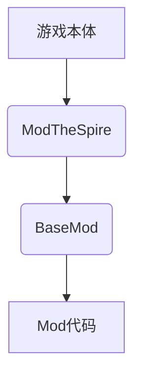
*图1 杀戮尖塔mod结构*

杀戮尖塔本体是由java语言构建的，构建方式属于典型的面向对象式的。具体而言就是将众多方法分类封装，然后在程序需要的时候调用。对此，mod代码也可以仿照杀戮尖塔的本体结构来搭建。

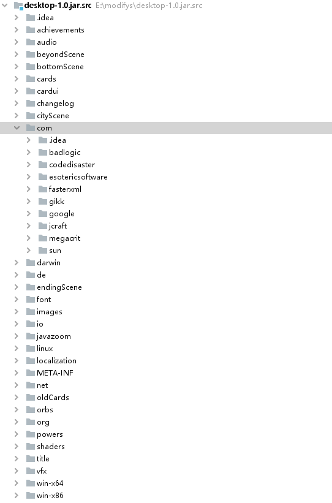
## 准备工作

### 游戏本体安装

（略）

### 下载必要的mod支持库

1. 在杀戮尖塔的steam页面中找到创意工坊（有条件的同学可以科学上网，也可使用第三方steam加速器）
2. 搜索stslib，basemod，以及modthespire。或是在右侧菜单勾选api寻找这三项。
3. 点击订阅即可。
   
   以上也是想要测试以及游玩其他人提供的mod的先决条件。

### 搭建mod开发环境

#### IDE的安装

杀戮尖塔由java语言编写，为了搭建mod这种大型java工程，我们可以使用IDE（集成开发环境）。目前主流的java IDE[^2]有[Eclipse](https://www.eclipse.org/downloads/)和[Intelij idea](https://www.jetbrains.com/zh-cn/idea/)。本教程后面将以IJ作为示例进行讲解。  
这两种IDE可以在官网上下载，其中Eclipse和Intelij的社区版都是免费的，可以直接使用。点击上文中的超链接即可在官网进行下载并安装。

[^2]: 集成开发环境，除了文中介绍的关于java的IDE。还常用visual studio或者xcode用于开发。


#### maven环境配置

[maven](http://maven.apache.org/download.cgi)是一款程序框架搭建平台，使用它就可以搭建类似于杀戮尖塔这样结构的java程序。  下面讲解下windows环境的配置方法。其他操作系统的配置方法可参考[此处](https://www.runoob.com/maven/maven-setup.html)。
首先通过超链接下载最新版本maven，然后在系统中设置环境变量如下：
1. 找到 计算机-属性-高级系统设置 ，点击环境变量。
2. 新建系统变量 **MAVEN_HOME** ，设置变量值：```E:\Maven\apache-maven-3.3.9```（若已存在则可跳过此步）
3. 寻找系统变量 **Path** ，选择编辑，之后选择新建，写入```;%MAVEN_HOME%\bin```


## 开始构建项目

### 构建步骤

至此我们完成了开发环境的配置，可以进行mod的开发工作了。下面以IJ为例来介绍如何构建一个项目：
1. 打开ij，新建一个maven项目，不勾选选择框。随后填写项目名和文件地址。(本项目取名为tutorial作为示例)
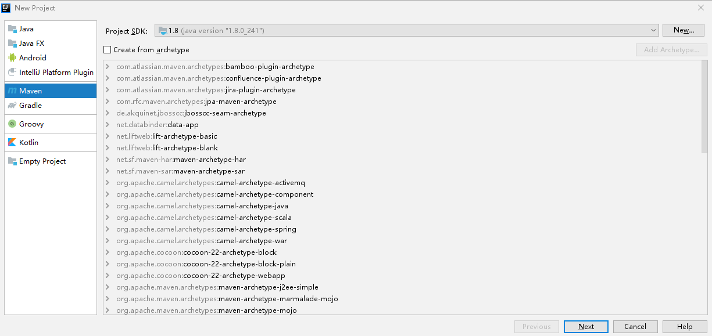
2. 进去之后如下编辑pom.xml：

```xml{.line-numbers}
<?xml version="1.0" encoding="UTF-8"?>
<project xmlns="http://maven.apache.org/POM/4.0.0"
         xmlns:xsi="http://www.w3.org/2001/XMLSchema-instance"
         xsi:schemaLocation="http://maven.apache.org/POM/4.0.0 http://maven.apache.org/xsd/maven-4.0.0.xsd">
    <modelVersion>4.0.0</modelVersion>

    <groupId>org.example</groupId>
    <artifactId>tutorial</artifactId>
    <version>0.1</version>
    <packaging>jar</packaging>

    <name>tutorialMod</name>
    <description>tutorial</description>

    <properties>
        <project.build.sourceEncoding>UTF-8</project.build.sourceEncoding>
        <steam.path>E:\SteamLibrary\steamapps</steam.path>
    </properties>

    <dependencies>
        <dependency>
            <groupId>bin</groupId>
            <artifactId>BaseMod</artifactId>
            <scope>system</scope>
            <version>1.0</version>
            <systemPath>${steam.path}/workshop/content/646570/1605833019/BaseMod.jar</systemPath>
        </dependency>
        <dependency>
            <groupId>bin</groupId>
            <artifactId>SlayTheSpire</artifactId>
            <scope>system</scope>
            <version>1.0</version>
            <systemPath>${steam.path}/common/SlayTheSpire/desktop-1.0.jar</systemPath>
        </dependency>
        <dependency>
            <groupId>bin</groupId>
            <artifactId>ModTheSpire</artifactId>
            <scope>system</scope>
            <version>1.0</version>
            <systemPath>${steam.path}/workshop/content/646570/1605060445/ModTheSpire.jar</systemPath>
        </dependency>
    </dependencies>

    <build>
        <finalName>tutorialMod</finalName>
        <plugins>
            <plugin>
                <groupId>org.apache.maven.plugins</groupId>
                <artifactId>maven-compiler-plugin</artifactId>
                <version>3.7.0</version>
                <configuration>
                    <source>1.8</source>
                    <target>1.8</target>
                </configuration>
            </plugin>
            <plugin>
                <groupId>org.apache.maven.plugins</groupId>
                <artifactId>maven-antrun-plugin</artifactId>
                <version>1.8</version>
                <executions>
                    <execution>
                        <phase>package</phase>
                        <configuration>
                            <target>
                                <copy file="target/tutorialMod.jar" tofile="${steam.path}/common/SlayTheSpire/mods/tutorialMod.jar"/>
                            </target>
                        </configuration>
                        <goals>
                            <goal>run</goal>
                        </goals>
                    </execution>
                </executions>
            </plugin>
        </plugins>
    </build>
</project>
```

在输入完代码后右下角会显示maven配置发生更改，此时选择import Changes即可。这段代码是maven的配置信息，其中包含了以下关键点：

- 这段代码的意思向指定目标文件夹输出编译好的jar文件，jar文件是代码包，也是所有mod的使用格式。在游玩时mod加载器会加载代码包中的文件，或者使用代码包中的代码覆盖游戏代码。version指的是版本控制中的版本号。

- properties项中规定了该文件的编码方式为UTF-8，这种编码方式允许我们使用中文定义变量，也保证了输出代码的准确性。steam/path中是steam游戏所在的文件夹，可根据steamlibrary文件夹的位置修改。

- dependencies加载了三个我们所需要的代码包，也就是上文所介绍的游戏主文件```desktop-1.0.jar```,和两个支持包```BaseMod.jar``` ```ModTheSpire.jar```

- build部分是关于jar的编译输出的，这里提示了maven的运作规律，会先生成测试文件夹，然后再将测试文件夹生成的文件拷贝到目标文件夹。

3. 此时可以看出文件的组织结构如下：
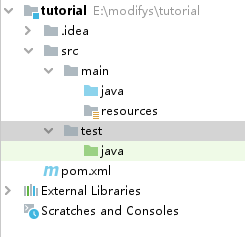
其中： 
    - .idea文件夹是IDE的辅助文件，与mod本身无关。
    - src是程序的主体部分，分成main和test两部分，其中test是maven自动生成的测试文件夹，maven会自动处理好相关细节。最重要的是main文件夹，java是我们存放代码的地方，而resource文件夹用于存放角色或卡面等图片或json格式的文字素材。  

这时我们可以在resource目录下写入```ModTheSpire.json```[^3]，该文件向ModTheSpire标识了该Mod的加载信息，格式如下：
[^3]:右键resource目录，选择New-file，将新建文件改名为ModTheSpire.json并编辑即可。

```json{.line-numbers}
{
  "modid": "tutoiral",
  "name": "tutoiralMod",
  "author_list": ["A","B"],
  "description": "新手教程mod",
  "version": "0.0.1",
  "sts_version": "03-29-2018",
  "mts_version": "2.6.0",
  "dependencies": ["basemod"]
}
```
Json文件中用花括号{}代表代码块，方括号[]代表数组，要注意他们的配对。这样我们就完成了mod初期的搭建工作。

### 测试构建效果

构建框架的目的是为了输出mod文件，格式为jar。为此我们要进行maven的package操作来测试搭建效果：
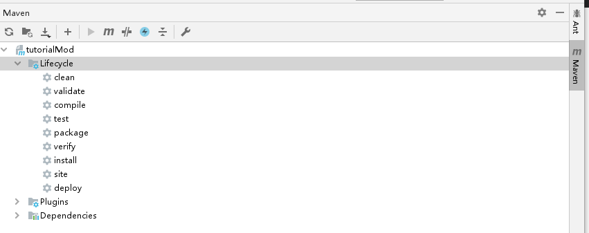
    点击右边的maven侧边，展开Lifecycle，这个指的是程序在输出执行的步骤。我们在这些步骤中双击package即可像杀戮尖塔的mod文件夹输出jar格式的mod。也可以点击上面的m按钮，在其中输入```mvn package```。

如果输出成功后，在steam中用withmod模式打开杀戮尖塔，即可在ModTheSpire画面中看到你刚才输出的文件中的标识信息。
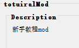

在界面中我们勾选Basemod和ModTheSpire，以及刚刚输出的mod（toturialMod），然后选择运行就可以进入游戏。
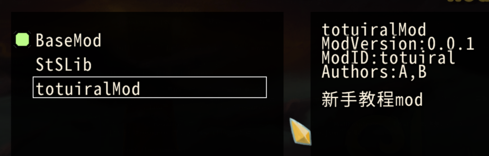

游戏中进入mod菜单，我们可以看到我们写下的标识信息，但是因为没有写任何代码，这个mod暂时还没有任何功能。
### 作业1
1. 仿照上文的方式，输出一个jar格式的mod文件并在游戏中运行。给mod取一个名字，并在作者（Author）一栏写上你的ID。
2. 研读加载mod时ModTheSpire的log框中的信息，尝试揣测他们是什么意思。

## Mod语法基础

### 创建新mod

Mod是通过支持库来对游戏代码进行添加，删改工作。所以第一步我们就是要让支持库知道我们创建了Mod，首先在java里面建立一个package命名为该mod的小写名称（本例为toturial），package有点类似于文件夹。我们在package里面添加第一个Class文件，将其命名为Mod的名称（比如在此案例中为Tutorial，或者也可命名为TutorialHook）。class是一个类文件，而类是java的一个代码单元。我们命名类的时候采用：首字母大写单词，之间大小写交错的形式。

在这个类中写入如下代码：
```Java{.line-numbers}
import com.evacipated.cardcrawl.modthespire.lib.SpireInitializer;
@SpireInitializer
public class Toturial {
    public Toturial() {
    }
    public static void initialize() {
        new Toturial();
    }
}
```

其中import指的是这里用到了别人写的类，在这里指的就是ModTheSpire里的代码。这几行代码非常简单，就是告诉ModTheSpire说，创建了一个新mod，叫做Toturial。在这里面```@SpireInitializer```表示以下代码是初始化内容。

有了这些代码我们就成功创建了一个新的mod，现在我们可以写点简单的功能。


### 控制台输出

我们之前观察过，在加载mod的时候和游戏过程中ModTheSpire会产生log信息，现在我们也可以命令控制台主动产生log。在这里面我们在mod初始化完成后在控制台输出经典的"hello world!"，我们只要在Initialize()的代码块里面加入这么一行命令即可：
```Java
System.out.print("hello world!");
```
每个语句用半角分号表示结束。该命令不仅能输出文本（字符串），也可以输出数字甚至表达式：
```Java
System.out.print("hello world! 5*6+30=");
System.out.print(5*6+30);
System.out.print("end of line!\n2+2="+4);//此处+代表文本之间相连，\n在此是一个字符，专门表示该行已结束。
```
将其输出为jar后我们可以观察加载该mod时产生的log。事实上在游戏中我们也可以插入这样的命令输出log，用于调试。我们可以看到控制台显示了这组输出。其中2ms表示2毫秒，显示了加载该mod所需时间
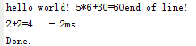


### 函数基础
除了输出字符，mod最重要的还是跟游戏中的各种行为进行互动。而这些依赖于java的函数，由于java是由各种各样的类构成的，所以函数都是成员函数（或称方法）。

#### 变量

函数可以用于处理输入和输出（也可以都不处理），为了表述输入这种行为，我们引入了变量去衡量输入的值。变量可以随着数值的不同而改变自己的值。在杀戮尖塔经常用的是这几种变量：整形，浮点型，布尔型，字符串型。

- 整形用于表示整数，根据正负分为有符号和无符号，也可根据占空间大小来区分，一般来讲支持的位数越高越占空间。杀戮尖塔mod开发中最常见的整数类型是整型，标识符为int，它占四个字节，可以表示从$-2^{31}$到$2^{31}-1$之间的整数。

- 浮点型表示小数，顾名思义它通过在二进制数位之间浮动小数点来表示对应的小数，在这我们不展开研究浮点数的表述方法。最常用的浮点数类型是float，占用4个字节，另一种类型double则要占用8个字节，精度也更高。我们会在一个数字后面加上f表示他为float,否则为double。

- 布尔型只存储两个值：true和false，表示真与假。用于做逻辑判断，对应计算机表示为0和1。但是java不允许将数字转化为布尔值，布尔值类型的标识符为boolean。

- 字符串是一串文本，是由很多字符组成的。他的使用与其他变量并不一致，较为特殊。使用String标识符

Java中创建变量由以下几个部分组成：
```Java{.line-numbers}
public int number;
private float dot=2.4f;
public static boolean judge=true;
public final String HELLO="Hello world!";
```
1. 属性：```public```表示它可以被类外的代码访问，```private```则表示只能在这个类里面被访问。```static```表示在函数结束后变量仍然被保留，```final```指变量的值不能被修改，表示一个常量。更多属性可以查阅相关java资料。
2. 标识符：用于表示变量的类型。
3. 名称：变量的名称一般使用大小写混合，以小写开头，避免使用单字母变量。如果带有final属性则表示为常量，名字全部用大写并使用下划线分隔单词。
4. 初始化：变量使用=赋值，在创建变量时赋值被称为初始化。未初始化的变量不能直接访问，需要赋值后访问。常量必须初始化。

#### 函数

函数具有输入端和输出端，表示方法如下：

```Java{.line-numbers}
private int print(String string,int num){
    System.out.print(string);
    return num;
}
```
1. 与变量类似，函数也有属性，例如public和private。
2. 函数用变量标识符表示具有该类型的输出值，可以被赋给某个变量或被另一个函数使用。
3. 函数括号内表示接受的变量类型，被称为形式参数。真正在调用过程中被传入的变量被称为实际参数，两者的命名没有任何关系。
4. 函数命名规则与变量类似，使用小写来命名
5. 函数使用return 语句来返回一个值，同时跳出函数体。  

值得一提的是函数可以没有返回值，也可以没有输入值。我们可以这样声明这种函数：
```Java{.line-numbers}
private void hello(){
    System.out.print("Hello world!");
    return;
}
```
此处使用了void标识符来表示没有返回值，return语句单纯表示跳出函数，可以省略等函数所有语句正常执行完自动跳出。

#### 类

java的基本代码单元就是类，在杀戮尖塔里面类有着非常清晰地实际意义。你使用的卡都是这种卡中的其中一张（对象），生成的一个电球也属于电球这个类型的一员。所以函数（成员函数也称**方法**）和变量都是放在类里面去讨论的，例如电球就具有放电攻击敌人，激发等函数，他的伤害作为变量又能随时受到集中值的影响。

类具有对象，而作为类的对象又能在其他类中使用。在一场战斗中，战场上就具有卡类的对象，玩家类的对象以及怪物类的对象同时出现。所以对象具有很重要的地位，申明一个对象的代码如下：
```Java
A a=new A();
```
其中A表示一个名为A的类，而这个a则是这个对象的代号（引用）。new 代表A创建了新对象，这里面出现了一个特殊的函数。表示创造一个新对象所需要的操作，这种函数叫做构造函数[^4]。比如创建一个新卡牌时要写入他的攻击力和费用，才能结束新卡牌的创建。

[^4]:构造函数往往需要传入参数，这里假设构造函数不需要传入参数。

由此我们可以看出，一个类是由对象所拥有的变量[^5]（例如卡的攻击力，玩家的生命值）和所拥有的函数（又称方法）构成的。

[^5]:也被称为成员，代表一个对象的组成成员。从内存上看，一个对象所占的内存确实是由所有成员所占的内存拼凑而来。也可被称为字段（Field），这里不探讨字段与成员的差别。

我们再回过头来审视我们创建的第一个类，这个类就有我们所说的部分功能
```Java{.line-numbers}
import com.evacipated.cardcrawl.modthespire.lib.SpireInitializer;
@SpireInitializer
public class Toturial {
    public Toturial() {
    }
    public static void initialize() {
        new Toturial();
    }
}
```

首先这里面具有一个构造函数，我们发现构造函数没有类型标识符，因为它必然不能被用于直接调用而返回一个参数。在```Initialize()```方法里面我们就通过构造函数创建了该mod的对象传入ModTheSpire，从而让ModTheSpire识别我们的Mod。

#### 作用域
之前我们多次提到了public和private这两个重要属性，为什么会有这种区别？public代表其具有全局属性，包括类。IDE为了结构的整齐性，强制要求公有类必须以单独文件的形式存在，这样就可以通过其他类中调用该类来实现类的全局化。调用公有类使用```import```：

```Java
import com.evacipated.cardcrawl.modthespire.lib.SpireInitializer;
```

其中最后一个单词代表类名，前面的单词代表该类所在的包名，这种格式十分类似于文件与文件夹。其他类只有通过这种方式才能访问到该公有类中的成员和函数。而其他类也只可访问这个类中的公有成员和函数，不能访问私有的。我们也可以用*通配符搜索并调用该包中的所有类：
```Java 
import com.evacipated.cardcrawl.modthespire.lib.*;
```
但是这种方式无法调用的该包中其他包中的类,也就是说：~~我封臣的封臣不是我的封臣~~
```Java
import com.evacipated.cardcrawl.modthespire.*; //这种方法无法调用com.evacipated.cardcrawl.modthespire.lib.SpireInitializer
```

作用域中还有一个属性非常重要，一般的成员都归对象所有，比如说手牌上有很多张打击，如果一张打击受到干瘪的手影响，这时其他打击的费用仍然是不变的。说明虽然都为打击类的对象，但是他们的成员能量是互不干涉的。但是如果具有```static```静态属性的话这个成员或者函数就归为类所有，所有该类对象都能共享这个静态成员和方法。我们也就不需要再用对象去访问他了，可以直接用类本身去访问。

假设打击[^6]这个类有两个成员，一个是打击卡的攻击力，一个是总共生成了多少张卡，以下是他们的访问方式：

[^6]:游戏中的打击类远比这个复杂。
```Java
strike a=new strike();
int dam=a.damage;//dam变量得到的是某张打击“a”的伤害值
int summary=strike.sum //summary得到的是打击这个类总共生成了多少张打击卡
```


### 作业2
以下提供了一个监听(hook)函数，根据给出的代码和提示实现以下功能：(改编自basemodWiki)
```Java{.line-numbers}
package toturial;

import basemod.interfaces.*;
import com.evacipated.cardcrawl.modthespire.lib.SpireInitializer;
import com.megacrit.cardcrawl.cards.DamageInfo;
import com.megacrit.cardcrawl.rooms.AbstractRoom;

import basemod.BaseMod;

@SpireInitializer
public class Toturial implements OnPlayerDamagedSubscriber,PostBattleSubscriber {
    

    public Toturial() {
        BaseMod.subscribe(this);
    }

    public static void initialize() {
        new Toturial();
    }

    @Override
    public int receiveOnPlayerDamaged(int damage, DamageInfo damageInfo) {
        //当玩家受到伤害，该函数接受玩家受到的伤害和伤害种类
        return damage;
    }

    @Override
    public void receivePostBattle(AbstractRoom r) {
        //该函数中的内容将在战斗结束后执行一次
        System.out.println();
    }
    
}
```
请在类中和函数体内补充代码，使得log能够输出每次战斗玩家受到的伤害总和。

## Mod结构构造

通过上面的讲述，我们对类和函数有了初步的认识。我们接下来补充类和函数，进而来构造杀戮尖塔Mod所需要的结构。

#### 监听函数

我们将函数的知识用于对游戏的互动来看，我们可以通过ModeTheSpire来让mod接受游戏中的行为，并用监听函数来对游戏内的行为做出反应。

现在我们扩充最开始的类文件：
```Java{.line-numbers}
package toturial;

import basemod.BaseMod;
import basemod.interfaces.PostDrawSubscriber;
import com.evacipated.cardcrawl.modthespire.lib.SpireInitializer;
import com.megacrit.cardcrawl.cards.AbstractCard;

@SpireInitializer
public class Toturial implements PostDrawSubscriber {
    public Toturial() {
        BaseMod.subscribe(this);
    }
    public static void initialize() {
        new Toturial();
        System.out.print("hello world! 5*6+30=");
        System.out.print(5*6+30);
        System.out.print("end of line!\n2+2="+4);//此处+代表文本之间相连，\n在此是一个字符，专门表示该行已结束。
    }

    @Override
    public void receivePostDraw(AbstractCard abstractCard) {
        System.out.println(abstractCard.name);//与print的区别在于println会自动换行
    }
}
```
这个类的意思是通过监听函数来得知玩家在游戏中抽到了了什么卡，并将结果输出在log上。我们将形参传入的对象做处理，得到了该形参的名字并输出。

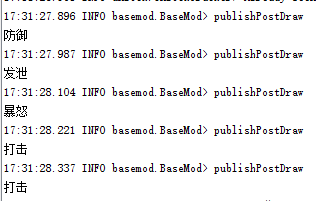

这段代码中涉及到了很多类的特性，接下来将逐步讲解。

### 引用

我们使用该程序再次做实验，这次我们先在初始化的时候交换两个int变量，之后再对抽取到的卡牌进行操作，观察结果：

```Java{.line-numbers}
package toturial;

import basemod.BaseMod;
import basemod.interfaces.PostDrawSubscriber;
import com.evacipated.cardcrawl.modthespire.lib.SpireInitializer;
import com.megacrit.cardcrawl.cards.AbstractCard;

@SpireInitializer
public class Toturial implements PostDrawSubscriber {
    public Toturial() {
        BaseMod.subscribe(this);
    }
    public static void initialize() {
        new Toturial();
        int a=1，b=100
        System.out.println(a+"    "+b);
        swap(a,b);//调用函数swap交换a，b数值
        System.out.println(a+"    "+b);//这一行会输出什么？
    }

    @Override
    public void receivePostDraw(AbstractCard abstractCard) {
        System.out.println(abstractCard.name);
        abstractCard.name="NULL";
    }

    public static void swap(int a,int b){//swap函数采用静态方法表示该方法不需要经过对象去调用
        int temp=a;
        a=b;
        b=temp;
        System.out.println(a+"    "+b);//输出交换后数值
    }
}
```

交换输出结果：
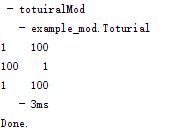
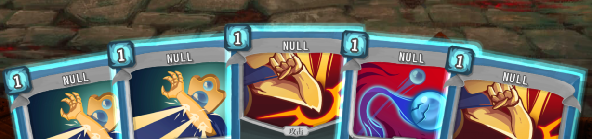

很容易就能发现，swap函数没有改变真实的数值，但是receivePostDraw函数却在函数结束后真实改变了卡牌的名字。这一点说明对象的传递机制和变量并不一样。

回忆对象的声明和变量的声明，这两个有着很大的差别：
```Java
A a=new A();
public int number=0;
```
我们在对象的声明中特意加入了new关键字以创建真正的对象，而a不是真正的对象，只是对象的引用[^7]。这样就产生了在函数传递过程中的不同情形。

[^7]:~~你甚至能把他理解为替身。~~

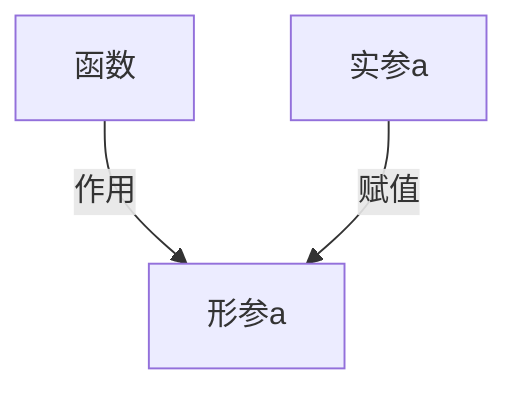
*图2 变量的传递过程，函数没有修改实参a*

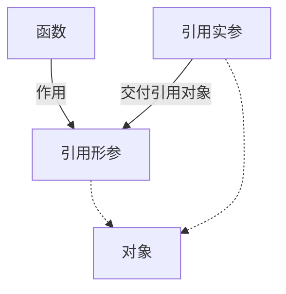
*图3 引用的传递过程，函数参与修改了对象[^8]*

[^8]:~~替身受到伤害主人也会受到伤害~~

由此可见传递对象的引用可以让函数对原值进行修改，而非复制。Java对此设计了封装基本变量的类，将变量转化为对象处理。
例如：
```Java
Integer i = new Integer(0);//对应int
Boolean b = new Boolean(False);//对应boolean
```
这种封装处理在之后的泛型操作中也会体现到。

### 继承

机器人具有多种能量球，但是这些能量球都有共同的行为：有共同的活动区域，能被激发，每回合会执行某种操作，能够响应弹幕齐射或者编译冲击。我们为了归纳这些种类不同但是本质上都是能量球的类型，我们引入了继承的概念。

首先我们创建一个总体的能量球类，然后再让各种各样的能量球继承这个能量球类。这样我们既可以在父类中兼顾到他们的共性，也能实现他们具有的不同的功能。这是面向对象设计的核心内容，也是杀戮尖塔mod制作的核心概念。

现在我们以腐化的源代码为例来详细讲述继承的有关概念。

```Java{.line-numbers}
package com.megacrit.cardcrawl.cards.red;

import com.badlogic.gdx.graphics.Color;
import com.megacrit.cardcrawl.actions.AbstractGameAction;
import com.megacrit.cardcrawl.actions.animations.VFXAction;
import com.megacrit.cardcrawl.actions.common.ApplyPowerAction;
import com.megacrit.cardcrawl.actions.utility.SFXAction;
import com.megacrit.cardcrawl.cards.AbstractCard;
import com.megacrit.cardcrawl.characters.AbstractPlayer;
import com.megacrit.cardcrawl.core.AbstractCreature;
import com.megacrit.cardcrawl.core.CardCrawlGame;
import com.megacrit.cardcrawl.localization.CardStrings;
import com.megacrit.cardcrawl.monsters.AbstractMonster;
import com.megacrit.cardcrawl.powers.AbstractPower;
import com.megacrit.cardcrawl.powers.CorruptionPower;
import com.megacrit.cardcrawl.vfx.AbstractGameEffect;
import com.megacrit.cardcrawl.vfx.BorderLongFlashEffect;
import com.megacrit.cardcrawl.vfx.combat.VerticalAuraEffect;

public class Corruption extends AbstractCard {
  public static final String ID = "Corruption";
  
  private static final CardStrings cardStrings = CardCrawlGame.languagePack.getCardStrings("Corruption");
  
  public Corruption() {
    super("Corruption", cardStrings.NAME, "red/power/corruption", 3, cardStrings.DESCRIPTION, AbstractCard.CardType.POWER, AbstractCard.CardColor.RED, AbstractCard.CardRarity.RARE, AbstractCard.CardTarget.SELF);
    this.baseMagicNumber = 3;
    this.magicNumber = this.baseMagicNumber;
  }
  
  public void use(AbstractPlayer p, AbstractMonster m) {
    addToBot((AbstractGameAction)new VFXAction((AbstractCreature)p, (AbstractGameEffect)new VerticalAuraEffect(Color.BLACK, p.hb.cX, p.hb.cY), 0.33F));
    addToBot((AbstractGameAction)new SFXAction("ATTACK_FIRE"));
    addToBot((AbstractGameAction)new VFXAction((AbstractCreature)p, (AbstractGameEffect)new VerticalAuraEffect(Color.PURPLE, p.hb.cX, p.hb.cY), 0.33F));
    addToBot((AbstractGameAction)new VFXAction((AbstractCreature)p, (AbstractGameEffect)new VerticalAuraEffect(Color.CYAN, p.hb.cX, p.hb.cY), 0.0F));
    addToBot((AbstractGameAction)new VFXAction((AbstractCreature)p, (AbstractGameEffect)new BorderLongFlashEffect(Color.MAGENTA), 0.0F, true));
    boolean powerExists = false;
    for (AbstractPower pow : p.powers) {
      if (pow.ID.equals("Corruption")) {
        powerExists = true;
        break;
      } 
    } 
    if (!powerExists)
      addToBot((AbstractGameAction)new ApplyPowerAction((AbstractCreature)p, (AbstractCreature)p, (AbstractPower)new CorruptionPower((AbstractCreature)p))); 
  }
  
  public void upgrade() {
    if (!this.upgraded) {
      upgradeName();
      upgradeBaseCost(2);
    } 
  }
  
  public AbstractCard makeCopy() {
    return new Corruption();
  }
}
```

这是官方代码中战士金卡腐化的代码，首先我们在腐化卡类的定义中找到了extends关键词，说明这个卡是继承自AbstructCard类。下面我们来简单介绍下这种继承关系的一些特性。

#### 继承关系

在继承关系中我们管被继承的类（这里指的是```AbstractCard```类）称作父类，而继承父类的类叫做子类（```Corruption```），继承关系表述子类具有父类方法和成员，并且比其他类拥有更高的权限来访问父类的成员。一个类只能有一个父类，但是父类却能有很多子类。（树形结构）

除了public和private属性，java还有一种特殊的属性是protected，意思是只有类本身和子类能够访问该成员或者方法。子类中可以省略父类的包含的方法代码。比如腐化与其他卡的共同方法如果没有修改的必要（比如绘图的方法render），就可以不用特意写出，而是直接调用父类已有的方法。

#### 抽象与多态
我们截取父类的use方法：
```Java
    //节选自AbstractCard.java
  public abstract void use(AbstractPlayer paramAbstractPlayer, AbstractMonster paramAbstractMonster);
```

我们发现这个方法有两点比较特殊，一是具有新的属性abstract，二是没有函数体。我们管这种方法叫做**抽象**方法，这种方法为子类提供了方法模板，子类可以任意修改该方法的内容。显然在游戏中使用不同的卡具有不同的效果，所以子类之间的```use()```方法并不相同，这种现象在面向对象编程中也叫**多态**。

游戏mod制作也是在抽象方法基础上填写自己想要实现的功能，从而制造自己想要的卡牌或其他元素，来创造多态。在腐化类中腐化就重写了use方法：
```Java{.line-numbers}
public void use(AbstractPlayer p, AbstractMonster m) {
    addToBot((AbstractGameAction)new VFXAction((AbstractCreature)p, (AbstractGameEffect)new VerticalAuraEffect(Color.BLACK, p.hb.cX, p.hb.cY), 0.33F));
    addToBot((AbstractGameAction)new SFXAction("ATTACK_FIRE"));
    addToBot((AbstractGameAction)new VFXAction((AbstractCreature)p, (AbstractGameEffect)new VerticalAuraEffect(Color.PURPLE, p.hb.cX, p.hb.cY), 0.33F));
    addToBot((AbstractGameAction)new VFXAction((AbstractCreature)p, (AbstractGameEffect)new VerticalAuraEffect(Color.CYAN, p.hb.cX, p.hb.cY), 0.0F));
    addToBot((AbstractGameAction)new VFXAction((AbstractCreature)p, (AbstractGameEffect)new BorderLongFlashEffect(Color.MAGENTA), 0.0F, true));
    boolean powerExists = false;
    for (AbstractPower pow : p.powers) {
      if (pow.ID.equals("Corruption")) {
        powerExists = true;
        break;
      } 
    } 
    if (!powerExists)
      addToBot((AbstractGameAction)new ApplyPowerAction((AbstractCreature)p, (AbstractCreature)p, (AbstractPower)new CorruptionPower((AbstractCreature)p))); 
  }
  ```

这些代码的意思我们将在后面具体讲述，在这里我们需要知道腐化在这里将抽象方法use实际化，我们才得以在游戏过程中使用这张卡[^9]

[^9]: ~~缺个树枝~~~

#### 封装

我们继续来看腐化的构造函数，这其中出现了两个新的关键词，我们来分别讲解。

```Java{.line-numbers}

  public Corruption() {
    super("Corruption", cardStrings.NAME, "red/power/corruption", 3, cardStrings.DESCRIPTION, AbstractCard.CardType.POWER, AbstractCard.CardColor.RED, AbstractCard.CardRarity.RARE, AbstractCard.CardTarget.SELF);
    this.baseMagicNumber = 3;
    this.magicNumber = this.baseMagicNumber;
  }
  ```
第一个是super关键词，这个意思是调用父类的对应函数，在这里也就是调用```AbstractCard```类的构造函数，在这里面我们像构造函数传入了数值来修改对应的成员。第二个是使用this关键词，this顾名思义表示的是正在调用这个方法的对象，通过this我们能够方便的对对象本身的成员进行操作。父类的构造函数收到这些变量会做出如下操作：
```Java{.line-numbers}

  public AbstractCard(String id, String name, String imgUrl, int cost, String rawDescription, CardType type, CardColor color, CardRarity rarity, CardTarget target, DamageInfo.DamageType dType) {
    this.originalName = name;
    this.name = name;
    this.cardID = id;
    this.assetUrl = imgUrl;
    this.portrait = cardAtlas.findRegion(imgUrl);
    this.jokePortrait = oldCardAtlas.findRegion(imgUrl);
    if (this.portrait == null)
      if (this.jokePortrait != null) {
        this.portrait = this.jokePortrait;
      } else {
        this.portrait = cardAtlas.findRegion("status/beta");
      }  
    this.cost = cost;
    this.costForTurn = cost;
    this.rawDescription = rawDescription;
    this.type = type;
    this.color = color;
    this.rarity = rarity;
    this.target = target;
    this.damageType = dType;
    this.damageTypeForTurn = dType;
    createCardImage();
    if (name == null || rawDescription == null)
      logger.info("Card initialized incorrecty"); 
    initializeTitle();
    initializeDescription();
    updateTransparency();
    this.uuid = UUID.randomUUID();
  }
```  

  
这种操作包含了一种思想，就是通过函数去修改对象的成员，而不是在外部类直接对对象成员进行修改。我们会发现这种成员一般都具有private或者protect的属性，这样可以做到只能通过类函数去修改而不是在外部修改。这种思想被称为**封装**，也是类设计中很重要的一环。

#### 接口

有的时候一个类可能是完全抽象的，这样我们可以将一个类定义为抽象类，用abstract属性修饰。或者我们可以把他写成一种特殊的类，叫做接口[^10]，用interface表示。接口的好处在于一个类虽然只能有一个父类，但是却能接入多个接口。在上面监听函数的实例中我们已经接触到了接口的概念。我们现在可以重新来审视这些代码来探究接口的性质。

[^10]:抽象类与接口在方法实现上有着非常细致的差别，在杀戮尖塔mod开发过程中我们不用去深究。

首先我们来回顾上面的监听抽牌的代码：
```Java{.line-numbers}
package toturial;

import basemod.BaseMod;
import basemod.interfaces.PostDrawSubscriber;
import com.evacipated.cardcrawl.modthespire.lib.SpireInitializer;
import com.megacrit.cardcrawl.cards.AbstractCard;

@SpireInitializer
public class Toturial implements PostDrawSubscriber {
    public Toturial() {
        BaseMod.subscribe(this);
    }
    public static void initialize() {
        new Toturial();
        System.out.print("hello world! 5*6+30=");
        System.out.print(5*6+30);
        System.out.print("end of line!\n2+2="+4);//此处+代表文本之间相连，\n在此是一个字符，专门表示该行已结束。
    }

    @Override
    public void receivePostDraw(AbstractCard abstractCard) {
        System.out.println(abstractCard.name);//与print的区别在于println会自动换行
    }
}
```
在这里面我们有implements关键词表示该类接入了一个接口，这个接口来自于Basemod，用于监听抽牌时的情况。我们注意到这里有着@override关键词。这个是编译器注释的一种，旨在告诉编译器我们要复写接口中的抽象方法。由于抽象方法本身没有任何意义，所以不管是子类还是被接入的类都必须要复写来自于父类或接口的抽象方法，否则编译器会报错。现在我们再来观察接口的代码实现来验证我的想法。

```Java{.line-numbers}
package basemod.interfaces;

import com.megacrit.cardcrawl.cards.DamageInfo;

public interface OnPlayerDamagedSubscriber extends ISubscriber {
    int receiveOnPlayerDamaged(int amount, DamageInfo info);
}
```

由于接口所有方法都是抽象的，所以接口方法的类型并不需要abstract关键词。这里注意到一个细节，接口也有继承[^11]，表示接口之间也有共同的抽象方法。

[^11]:事实上ISubscriber是个空接口，在这里只表明了一种接口之间的结构关系。如果父接口不是空接口，子接口还要注明父接口中的所有方法。

### Mod结构

综上所述，我们知道杀戮尖塔游戏以及mod都是由类的调用和继承组成的复杂网络，我们可以在这里简单的整理一下杀戮尖塔mod所需要的类结构：
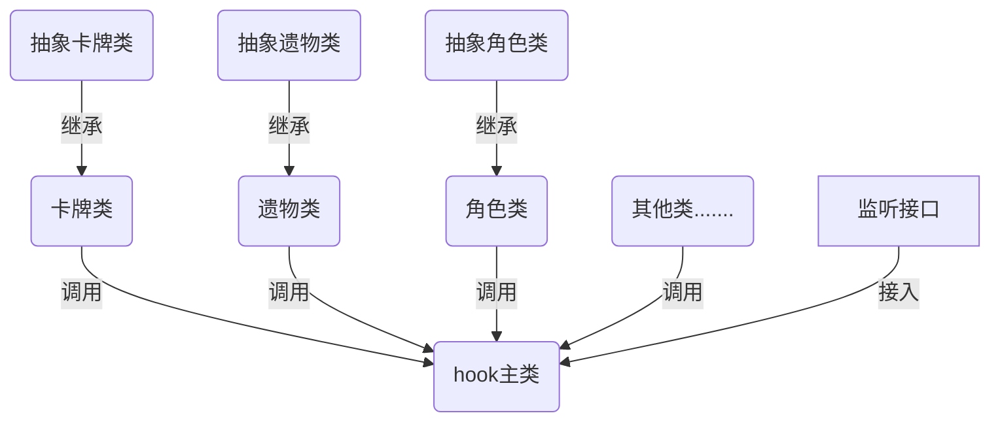
*图4 杀戮尖塔mod的类结构*

这些结构在文件上都是写在java文件夹中，表示用java代码进行面向对象设计。同时这些类还会调用位于resources文件夹中的图片或文字资源，形成总体的mod结构网络。总体而言接口负责提供方法让mod进行初始化植入游戏和监听游戏中的事件，而其他类的负责mod的代码实现。

### 反编译
jar格式的包不能直接打开，但是我们可以正常的用import调用jar中的类与方法。为了更好地研究包中的类，我们可以使用工具将jar拆成文件夹和内部的代码结构。例如我们可以直接拆开游戏本体来研究其中卡牌代码的实现。反编译的工具可以使用[jdgui](http://java-decompiler.github.io/)。


使用方法为：Open File打开后可以在工具中观看jar内部结构，然后选择Save All Source保存整个jar中的文件为zip，解压后用ij打开解压后的文件夹即可开始研究内部代码。其他的反编译jar工具的用法也类似。需要注意的是，反编译后的jar与普通项目工程有很大不同，jar会主动将使用常量的部分转化为初始值。而且编译也会破坏项目的maven结构，反编译后无法直接重编译。

### 作业3
利用反编译工具拆包游戏主文件```desktop-1.0.jar```，它位于游戏根目录下。然后用IDE打开该文件夹研究代码：
1. 双击shift，在出现的搜索栏中输入Frost.java，研究冰球代码。
2. 再次双击shift，搜索其父类AbstractOrb.java，研究抽象的能量球代码。
3. 以此说明父类具有哪些方法，分别具有什么类型，哪些方法被子类重写，子类是否有属于自己的方法。

## Mod方法的实现

### 添加自定义元素

我们在类结构中得知，我们需要在主函数调用其他类文件，使得其他类文件能够被游戏探知。在游戏中我们使用basemod.jar提供的basemod.add方法来加入诸如卡牌遗物等物品，实例如下。

```Java
package toturial;

import basemod.interfaces.*;
import com.evacipated.cardcrawl.modthespire.lib.SpireInitializer;
import basemod.BaseMod;

import toturial.cards.*;
import toturial.relics.*;
import toturial.character.*;

@SpireInitializer
public class Toturial implements EditCharactersSubscriber,EditCardsSubscriber,EditRelicsSubscriber  {


    public Toturial() {
        BaseMod.subscribe(this);
    }

    public static void initialize() {
        new Toturial();
    }


    @Override
    public void receiveEditCharacters() {
        BaseMod.addCharacter(new MyCharcter(CardCrawlGame.playerName),
                MY_CHARACTER_BUTTON,
                MY_CHARACTER_PORTRAIT,
                MyPlayerClassEnum.MY_PLAYER_CLASS);//加入新角色
    }

    @Override
    public void receiveEditCards() {
        BaseMod.addCard(new MyCard());//加入新卡牌
    }

    @Override
    public void receiveEditRelics() {
        BaseMod.addRelic(new MyRelic());//加入新遗物
    }
}
```

上面只是列举了一部分可以加入的成分，更多的加入接口可以在此查找。