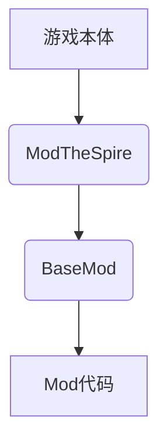
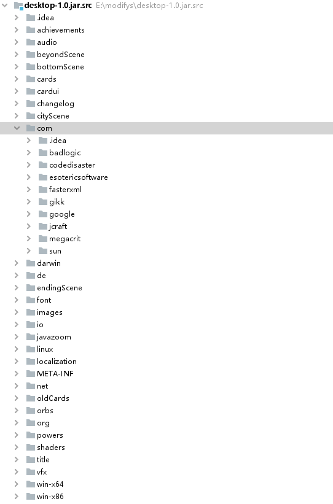

# 杀戮尖塔MOD入门教程

## 简介
杀戮尖塔的MOD都需要modthespire,stslib和basemod这三大支持库来支持，杀戮尖塔mod的本质是在游戏本体中通过第三方API（程序接口）来添加自己的代码。

*图1 杀戮尖塔mod结构*

杀戮尖塔本体是由java语言构建的，构建方式属于典型的面向对象式的。具体而言就是将众多方法分类封装，然后在程序需要的时候调用。对此，mod代码也可以仿照杀戮尖塔的本体结构来搭建。

*图2 杀戮尖塔游戏本体代码结构*

## 准备工作

### 游戏本体安装

（略）

### 下载必要的mod支持库

1. 在杀戮尖塔的steam页面中找到创意工坊（有条件的同学可以科学上网，也可使用第三方steam加速器）
2. 搜索stslib，basemod，以及modthespire。或是在右侧菜单勾选api寻找这三项。
3. 点击订阅即可。
   
   以上也是想要测试以及游玩其他人提供的mod的先决条件。

### 搭建mod开发环境

mod