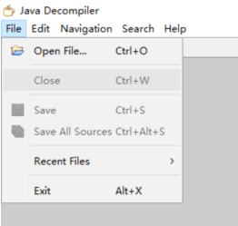

# 杀戮尖塔MOD入门教程 


<!-- @import "[TOC]" {cmd="toc" depthFrom=1 depthTo=6 orderedList=false} -->

<!-- code_chunk_output -->

- [杀戮尖塔MOD入门教程](#杀戮尖塔mod入门教程)
  - [简介](#简介)
  - [准备工作](#准备工作)
    - [游戏本体安装](#游戏本体安装)
    - [下载必要的mod支持库](#下载必要的mod支持库)
    - [搭建mod开发环境](#搭建mod开发环境)
      - [IDE的安装](#ide的安装)
      - [maven环境配置](#maven环境配置)
  - [开始构建项目](#开始构建项目)
    - [构建步骤](#构建步骤)
    - [测试构建效果](#测试构建效果)
    - [作业1](#作业1)
  - [Mod语法基础](#mod语法基础)
    - [创建新mod](#创建新mod)
    - [控制台输出](#控制台输出)
    - [函数基础](#函数基础)
      - [变量](#变量)
      - [函数](#函数)
      - [重载](#重载)
      - [类](#类)
      - [作用域](#作用域)
    - [作业2](#作业2)
  - [Mod结构构造](#mod结构构造)
      - [监听函数](#监听函数)
    - [引用](#引用)
    - [继承](#继承)
      - [继承关系](#继承关系)
      - [抽象与多态](#抽象与多态)
      - [接口](#接口)
    - [Mod结构](#mod结构)
    - [反编译](#反编译)
    - [作业3](#作业3)
  - [方法实现的基础知识](#方法实现的基础知识)
    - [结构式编程](#结构式编程)
      - [判断结构](#判断结构)
      - [运算顺序](#运算顺序)
      - [循环结构](#循环结构)
    - [常用类对象](#常用类对象)
      - [String类](#string类)
      - [数组](#数组)
      - [ArrayList](#arraylist)
      - [向上转型](#向上转型)
      - [枚举类](#枚举类)
    - [作业4](#作业4)
  - [mod修改技术](#mod修改技术)
    - [添加自定义元素](#添加自定义元素)
    - [添加文本](#添加文本)
      - [添加描述文本](#添加描述文本)
      - [Json描述文件格式](#json描述文件格式)
      - [载入关键词](#载入关键词)
    - [构建自定义类](#构建自定义类)
      - [卡牌类](#卡牌类)
        - [方法详解](#方法详解)
        - [命令队列](#命令队列)
      - [遗物类](#遗物类)
      - [其他类简析](#其他类简析)
    - [修改实例分析](#修改实例分析)
  - [高级修改技巧](#高级修改技巧)
    - [哈希表](#哈希表)
    - [反射](#反射)
    - [泛型](#泛型)
    - [函数式编程](#函数式编程)
    - [修补主程序](#修补主程序)

<!-- /code_chunk_output -->


## 简介
杀戮尖塔的MOD都需要modthespire,stslib和basemod这三大支持库来支持，杀戮尖塔mod的本质是在游戏本体中通过第三方API [^1]来添加自己的代码

[^1]: 应用程序接口，提供了代码抽象功能。


*图1 杀戮尖塔mod结构*

杀戮尖塔本体是由java语言构建的，构建方式属于典型的面向对象式的。具体而言就是将众多方法分类封装，然后在程序需要的时候调用。对此，mod代码也可以仿照杀戮尖塔的本体结构来搭建。


## 准备工作

### 游戏本体安装

（略）

### 下载必要的mod支持库

1. 在杀戮尖塔的steam页面中找到创意工坊（有条件的同学可以科学上网，也可使用第三方steam加速器）
2. 搜索stslib，basemod，以及modthespire。或是在右侧菜单勾选api寻找这三项。
3. 点击订阅即可。
   
   以上也是想要测试以及游玩其他人提供的mod的先决条件。

### 搭建mod开发环境

#### IDE的安装

杀戮尖塔由java语言编写，为了搭建mod这种大型java工程，我们可以使用IDE（集成开发环境）。目前主流的java IDE[^2]有[Eclipse](https://www.eclipse.org/downloads/)和[Intelij idea](https://www.jetbrains.com/zh-cn/idea/)。本教程后面将以IJ作为示例进行讲解。  
这两种IDE可以在官网上下载，其中Eclipse和Intelij的社区版都是免费的，可以直接使用。点击上文中的超链接即可在官网进行下载并安装。

[^2]: 集成开发环境，除了文中介绍的关于java的IDE。还常用visual studio或者xcode用于开发。


#### maven环境配置

[maven](http://maven.apache.org/download.cgi)是一款程序框架搭建平台，使用它就可以搭建类似于杀戮尖塔这样结构的java程序。  下面讲解下windows环境的配置方法。其他操作系统的配置方法可参考[此处](https://www.runoob.com/maven/maven-setup.html)。
首先通过超链接下载最新版本maven，然后在系统中设置环境变量如下：
1. 找到 计算机-属性-高级系统设置 ，点击环境变量。
2. 新建系统变量 **MAVEN_HOME** ，设置变量值：```E:\Maven\apache-maven-3.3.9```（若已存在则可跳过此步）
3. 寻找系统变量 **Path** ，选择编辑，之后选择新建，写入```;%MAVEN_HOME%\bin```

第一次配置maven需要较长时间下载支持库，属于正常现象。

## 开始构建项目

### 构建步骤

至此我们完成了开发环境的配置，可以进行mod的开发工作了。下面以IJ为例来介绍如何构建一个项目：
1. 打开ij，新建一个maven项目，不勾选选择框。随后填写项目名和文件地址。(本项目取名为tutorial作为示例)

2. 进去之后如下编辑pom.xml：

```xml{.line-numbers}
<?xml version="1.0" encoding="UTF-8"?>
<project xmlns="http://maven.apache.org/POM/4.0.0"
         xmlns:xsi="http://www.w3.org/2001/XMLSchema-instance"
         xsi:schemaLocation="http://maven.apache.org/POM/4.0.0 http://maven.apache.org/xsd/maven-4.0.0.xsd">
    <modelVersion>4.0.0</modelVersion>

    <groupId>org.example</groupId>
    <artifactId>tutorial</artifactId>
    <version>0.1</version>
    <packaging>jar</packaging>

    <name>tutorialMod</name>
    <description>tutorial</description>

    <properties>
        <project.build.sourceEncoding>UTF-8</project.build.sourceEncoding>
        <steam.path>E:\SteamLibrary\steamapps</steam.path>
    </properties>

    <dependencies>
        <dependency>
            <groupId>bin</groupId>
            <artifactId>BaseMod</artifactId>
            <scope>system</scope>
            <version>1.0</version>
            <systemPath>${steam.path}/workshop/content/646570/1605833019/BaseMod.jar</systemPath>
        </dependency>
        <dependency>
            <groupId>bin</groupId>
            <artifactId>SlayTheSpire</artifactId>
            <scope>system</scope>
            <version>1.0</version>
            <systemPath>${steam.path}/common/SlayTheSpire/desktop-1.0.jar</systemPath>
        </dependency>
        <dependency>
            <groupId>bin</groupId>
            <artifactId>ModTheSpire</artifactId>
            <scope>system</scope>
            <version>1.0</version>
            <systemPath>${steam.path}/workshop/content/646570/1605060445/ModTheSpire.jar</systemPath>
        </dependency>
    </dependencies>

    <build>
        <finalName>tutorialMod</finalName>
        <plugins>
            <plugin>
                <groupId>org.apache.maven.plugins</groupId>
                <artifactId>maven-compiler-plugin</artifactId>
                <version>3.7.0</version>
                <configuration>
                    <source>1.8</source>
                    <target>1.8</target>
                </configuration>
            </plugin>
            <plugin>
                <groupId>org.apache.maven.plugins</groupId>
                <artifactId>maven-antrun-plugin</artifactId>
                <version>1.8</version>
                <executions>
                    <execution>
                        <phase>package</phase>
                        <configuration>
                            <target>
                                <copy file="target/tutorialMod.jar" tofile="${steam.path}/common/SlayTheSpire/mods/tutorialMod.jar"/>
                            </target>
                        </configuration>
                        <goals>
                            <goal>run</goal>
                        </goals>
                    </execution>
                </executions>
            </plugin>
        </plugins>
    </build>
</project>
```

在输入完代码后右下角会显示maven配置发生更改，此时选择import Changes即可。这段代码是maven的配置信息，其中包含了以下关键点：

- 这段代码的意思向指定目标文件夹输出编译好的jar文件，jar文件是代码包，也是所有mod的使用格式。在游玩时mod加载器会加载代码包中的文件，或者使用代码包中的代码覆盖游戏代码。version指的是版本控制中的版本号。

- properties项中规定了该文件的编码方式为UTF-8，这种编码方式允许我们使用中文定义变量，也保证了输出代码的准确性。steam/path中是steam游戏所在的文件夹，可根据steamlibrary文件夹的位置修改。

- dependencies加载了三个我们所需要的代码包，也就是上文所介绍的游戏主文件```desktop-1.0.jar```,和两个支持包```BaseMod.jar``` ```ModTheSpire.jar```

- build部分是关于jar的编译输出的，这里提示了maven的运作规律，会先生成测试文件夹，然后再将测试文件夹生成的文件拷贝到目标文件夹。

3. 此时可以看出文件的组织结构如下：

其中： 
    - .idea文件夹是IDE的辅助文件，与mod本身无关。
    - src是程序的主体部分，分成main和test两部分，其中test是maven自动生成的测试文件夹，maven会自动处理好相关细节。最重要的是main文件夹，java是我们存放代码的地方，而resource文件夹用于存放角色或卡面等图片或json格式的文字素材。  

这时我们可以在resource目录下写入```ModTheSpire.json```[^3]，该文件向ModTheSpire标识了该Mod的加载信息，格式如下：
[^3]:右键resource目录，选择New-file，将新建文件改名为ModTheSpire.json并编辑即可。

```json{.line-numbers}
{
  "modid": "tutoiral",
  "name": "tutoiralMod",
  "author_list": ["A","B"],
  "description": "新手教程mod",
  "version": "0.0.1",
  "sts_version": "03-29-2018",
  "mts_version": "2.6.0",
  "dependencies": ["basemod"]
}
```
Json文件中用花括号{}代表代码块，方括号[]代表数组，要注意他们的配对。这样我们就完成了mod初期的搭建工作。

### 测试构建效果

构建框架的目的是为了输出mod文件，格式为jar。为此我们要进行maven的package操作来测试搭建效果：

    点击右边的maven侧边，展开Lifecycle，这个指的是程序在输出执行的步骤。我们在这些步骤中双击package即可像杀戮尖塔的mod文件夹输出jar格式的mod。也可以点击上面的m按钮，在其中输入```mvn package```。

如果输出成功后，在steam中用withmod模式打开杀戮尖塔，即可在ModTheSpire画面中看到你刚才输出的文件中的标识信息。


在界面中我们勾选Basemod和ModTheSpire，以及刚刚输出的mod（toturialMod），然后选择运行就可以进入游戏。


游戏中进入mod菜单，我们可以看到我们写下的标识信息，但是因为没有写任何代码，这个mod暂时还没有任何功能。
### 作业1
1. 仿照上文的方式，输出一个jar格式的mod文件并在游戏中运行。给mod取一个名字，并在作者（Author）一栏写上你的ID。
2. 研读加载mod时ModTheSpire的log框中的信息，尝试揣测他们是什么意思。

## Mod语法基础

### 创建新mod

Mod是通过支持库来对游戏代码进行添加，删改工作。所以第一步我们就是要让支持库知道我们创建了Mod，首先在java里面建立一个package命名为该mod的小写名称（本例为toturial），package有点类似于文件夹。我们在package里面添加第一个Class文件，将其命名为Mod的名称（比如在此案例中为Tutorial，或者也可命名为TutorialHook）。class是一个类文件，而类是java的一个代码单元。我们命名类的时候采用：首字母大写单词，之间大小写交错的形式。

在这个类中写入如下代码：
```Java{.line-numbers}
import com.evacipated.cardcrawl.modthespire.lib.SpireInitializer;
@SpireInitializer
public class Toturial {
    public Toturial() {
    }
    public static void initialize() {
        new Toturial();
    }
}
```

其中import指的是这里用到了别人写的类，在这里指的就是ModTheSpire里的代码。这几行代码非常简单，就是告诉ModTheSpire说，创建了一个新mod，叫做Toturial。在这里面```@SpireInitializer```表示以下代码是初始化内容。

有了这些代码我们就成功创建了一个新的mod，现在我们可以写点简单的功能。


### 控制台输出

我们之前观察过，在加载mod的时候和游戏过程中ModTheSpire会产生log信息，现在我们也可以命令控制台主动产生log。在这里面我们在mod初始化完成后在控制台输出经典的"hello world!"，我们只要在Initialize()的代码块里面加入这么一行命令即可：
```Java
System.out.print("hello world!");
```
每个语句用半角分号表示结束。该命令不仅能输出文本（字符串），也可以输出数字甚至表达式：
```Java
System.out.print("hello world! 5*6+30=");
System.out.print(5*6+30);
System.out.print("end of line!\n2+2="+4);//此处+代表文本之间相连，\n在此是一个字符，专门表示该行已结束。
```
将其输出为jar后我们可以观察加载该mod时产生的log。事实上在游戏中我们也可以插入这样的命令输出log，用于调试。我们可以看到控制台显示了这组输出。其中2ms表示2毫秒，显示了加载该mod所需时间


### 函数基础
除了输出字符，mod最重要的还是跟游戏中的各种行为进行互动。而这些依赖于java的函数，由于java是由各种各样的类构成的，所以函数都是成员函数（或称方法）。

#### 变量

函数可以用于处理输入和输出（也可以都不处理），为了表述输入这种行为，我们引入了变量去衡量输入的值。变量可以随着数值的不同而改变自己的值。在杀戮尖塔经常用的是这几种变量：整形，浮点型，布尔型，字符串型。

- 整形用于表示整数，根据正负分为有符号和无符号，也可根据占空间大小来区分，一般来讲支持的位数越高越占空间。杀戮尖塔mod开发中最常见的整数类型是整型，标识符为int，它占四个字节，可以表示从$-2^{31}$到$2^{31}-1$之间的整数。

- 浮点型表示小数，顾名思义它通过在二进制数位之间浮动小数点来表示对应的小数，在这我们不展开研究浮点数的表述方法。最常用的浮点数类型是float，占用4个字节，另一种类型double则要占用8个字节，精度也更高。我们会在一个数字后面加上f表示他为float,否则为double。

- 布尔型只存储两个值：true和false，表示真与假。用于做逻辑判断，对应计算机表示为0和1。但是java不允许将数字转化为布尔值，布尔值类型的标识符为boolean。

- 字符串是一串文本，是由很多字符组成的。他的使用与其他变量并不一致，较为特殊。使用String标识符

Java中创建变量由以下几个部分组成：
```Java{.line-numbers}
public int number;
private float dot=2.4f;
public static boolean judge=true;
public final String HELLO="Hello world!";
```
1. 属性：```public```表示它可以被类外的代码访问，```private```则表示只能在这个类里面被访问。```static```表示在函数结束后变量仍然被保留，```final```指变量的值不能被修改，表示一个常量。更多属性可以查阅相关java资料。如果没有任何属性则表示该变量为default，作用域为同一个包的所有类。
2. 标识符：用于表示变量的类型。
3. 名称：变量的名称一般使用大小写混合，以小写开头，避免使用单字母变量。如果带有final属性则表示为常量，名字全部用大写并使用下划线分隔单词。
4. 初始化：变量使用=赋值，在创建变量时赋值被称为初始化。未初始化的变量不能直接访问，需要赋值后访问。常量必须初始化。

#### 函数

函数具有输入端和输出端，表示方法如下：

```Java{.line-numbers}
private int print(String string,int num){
    System.out.print(string);
    return num;
}
```
1. 与变量类似，函数也有属性，例如public和private。
2. 函数用变量标识符表示具有该类型的输出值，可以被赋给某个变量或被另一个函数使用。
3. 函数括号内表示接受的变量类型，被称为形式参数。真正在调用过程中被传入的变量被称为实际参数，两者的命名没有任何关系。
4. 函数命名规则与变量类似，使用小写来命名
5. 函数使用return 语句来返回一个值，同时跳出函数体。  

值得一提的是函数可以没有返回值，也可以没有输入值。我们可以这样声明这种函数：
```Java{.line-numbers}
private void hello(){
    System.out.print("Hello world!");
    return;
}
```
此处使用了void标识符来表示没有返回值，return语句单纯表示跳出函数，可以省略等函数所有语句正常执行完自动跳出。


#### 重载

只有传入对象完全一致的两个函数是一致的，也就是说如果同一个函数名接受不同的变量，也不会在使用中造成冲突。这种现象被称为**重载**，我们将会在杀戮尖塔mod制作中经常见到函数的重载。
```Java{.line-numbers}
public void hello(){
  System.out.print("Hello world!");
}
public void hello(String s){
  System.out.print("Hello "+s+"!");
}
```

我们根据这个例子可以看出，函数重载可以提高函数输入的灵活性，也可以互相起到补充作用。

#### 类

java的基本代码单元就是类，在杀戮尖塔里面类有着非常清晰地实际意义。你使用的卡都是这种卡中的其中一张（对象），生成的一个电球也属于电球这个类型的一员。所以函数（成员函数也称**方法**）和变量都是放在类里面去讨论的，例如电球就具有放电攻击敌人，激发等函数，他的伤害作为变量又能随时受到集中值的影响。

类具有对象，而作为类的对象又能在其他类中使用。在一场战斗中，战场上就具有卡类的对象，玩家类的对象以及怪物类的对象同时出现。所以对象具有很重要的地位，申明一个对象的代码如下：
```Java
A a=new A();
```
其中A表示一个名为A的类，而这个a则是这个对象的代号（引用）。new 代表A创建了新对象，这里面出现了一个特殊的函数。表示创造一个新对象所需要的操作，这种函数叫做构造函数[^4]。比如创建一个新卡牌时要写入他的攻击力和费用，才能结束新卡牌的创建。

[^4]:构造函数往往需要传入参数，这里假设构造函数不需要传入参数。

由此我们可以看出，一个类是由对象所拥有的变量[^5]（例如卡的攻击力，玩家的生命值）和所拥有的函数（又称方法）构成的。

[^5]:也被称为成员，代表一个对象的组成成员。从内存上看，一个对象所占的内存确实是由所有成员所占的内存拼凑而来。也可被称为字段（Field），这里不探讨字段与成员的差别。

我们再回过头来审视我们创建的第一个类，这个类就有我们所说的部分功能
```Java{.line-numbers}
import com.evacipated.cardcrawl.modthespire.lib.SpireInitializer;
@SpireInitializer
public class Toturial {
    public Toturial() {
    }
    public static void initialize() {
        new Toturial();
    }
}
```

首先这里面具有一个构造函数，我们发现构造函数没有类型标识符，因为它必然不能被用于直接调用而返回一个参数。在```Initialize()```方法里面我们就通过构造函数创建了该mod的对象传入ModTheSpire，从而让ModTheSpire识别我们的Mod。

函数可以处理类的对象，是通过引用方式来传递的，后面我们还会具体讲解。

#### 作用域
之前我们多次提到了public和private这两个重要属性，为什么会有这种区别？public代表其具有全局属性，包括类。IDE为了结构的整齐性，强制要求公有类必须以单独文件的形式存在，这样就可以通过其他类中调用该类来实现类的全局化。调用公有类使用```import```：

```Java
import com.evacipated.cardcrawl.modthespire.lib.SpireInitializer;
```

其中最后一个单词代表类名，前面的单词代表该类所在的包名，这种格式十分类似于文件与文件夹。其他类只有通过这种方式才能访问到该公有类中的成员和函数。而其他类也只可访问这个类中的公有成员和函数，不能访问私有的。我们也可以用*通配符搜索并调用该包中的所有类：
```Java 
import com.evacipated.cardcrawl.modthespire.lib.*;
```
但是这种方式无法调用的该包中其他包中的类,也就是说：~~我封臣的封臣不是我的封臣~~
```Java
import com.evacipated.cardcrawl.modthespire.*; //这种方法无法调用com.evacipated.cardcrawl.modthespire.lib.SpireInitializer
```

作用域中还有一个属性非常重要，一般的成员都归对象所有，比如说手牌上有很多张打击，如果一张打击受到干瘪的手影响，这时其他打击的费用仍然是不变的。说明虽然都为打击类的对象，但是他们的成员能量是互不干涉的。但是如果具有```static```静态属性的话这个成员或者函数就归为类所有，所有该类对象都能共享这个静态成员和方法。我们也就不需要再用对象去访问他了，可以直接用类本身去访问。

假设打击[^6]这个类有两个成员，一个是打击卡的攻击力，一个是总共生成了多少张卡，以下是他们的访问方式：

[^6]:游戏中的打击类远比这个复杂。
```Java
strike a=new strike();
int dam=a.damage;//dam变量得到的是某张打击“a”的伤害值
int summary=strike.sum //summary得到的是打击这个类总共生成了多少张打击卡
```

在函数作用域以及代码块作用域内（判断，循环）只允许使用默认变量，不能用public和private修饰。

### 作业2
以下提供了一个监听(hook)函数，根据给出的代码和提示实现以下功能：(改编自basemodWiki)
```Java{.line-numbers}
package toturial;

import basemod.interfaces.*;
import com.evacipated.cardcrawl.modthespire.lib.SpireInitializer;
import com.megacrit.cardcrawl.cards.DamageInfo;
import com.megacrit.cardcrawl.rooms.AbstractRoom;

import basemod.BaseMod;

@SpireInitializer
public class Toturial implements OnPlayerDamagedSubscriber,PostBattleSubscriber {
    

    public Toturial() {
        BaseMod.subscribe(this);
    }

    public static void initialize() {
        new Toturial();
    }

    @Override
    public int receiveOnPlayerDamaged(int damage, DamageInfo damageInfo) {
        //当玩家受到伤害，该函数接受玩家受到的伤害和伤害种类
        return damage;
    }

    @Override
    public void receivePostBattle(AbstractRoom r) {
        //该函数中的内容将在战斗结束后执行一次
        System.out.println();
    }
    
}
```
请在类中和函数体内补充代码，使得log能够输出每次战斗玩家受到的伤害总和。

## Mod结构构造

通过上面的讲述，我们对类和函数有了初步的认识。我们接下来补充类和函数，进而来构造杀戮尖塔Mod所需要的结构。

#### 监听函数

我们将函数的知识用于对游戏的互动来看，我们可以通过ModeTheSpire来让mod接受游戏中的行为，并用监听函数来对游戏内的行为做出反应。

现在我们扩充最开始的类文件：
```Java{.line-numbers}
package toturial;

import basemod.BaseMod;
import basemod.interfaces.PostDrawSubscriber;
import com.evacipated.cardcrawl.modthespire.lib.SpireInitializer;
import com.megacrit.cardcrawl.cards.AbstractCard;

@SpireInitializer
public class Toturial implements PostDrawSubscriber {
    public Toturial() {
        BaseMod.subscribe(this);
    }
    public static void initialize() {
        new Toturial();
        System.out.print("hello world! 5*6+30=");
        System.out.print(5*6+30);
        System.out.print("end of line!\n2+2="+4);//此处+代表文本之间相连，\n在此是一个字符，专门表示该行已结束。
    }

    @Override
    public void receivePostDraw(AbstractCard abstractCard) {
        System.out.println(abstractCard.name);//与print的区别在于println会自动换行
    }
}
```
这个类的意思是通过监听函数来得知玩家在游戏中抽到了了什么卡，并将结果输出在log上。我们将形参传入的对象做处理，得到了该形参的名字并输出。


这段代码中涉及到了很多类的特性，接下来将逐步讲解。

### 引用

我们使用该程序再次做实验，这次我们先在初始化的时候交换两个int变量，之后再对抽取到的卡牌进行操作，观察结果：

```Java{.line-numbers}
package toturial;

import basemod.BaseMod;
import basemod.interfaces.PostDrawSubscriber;
import com.evacipated.cardcrawl.modthespire.lib.SpireInitializer;
import com.megacrit.cardcrawl.cards.AbstractCard;

@SpireInitializer
public class Toturial implements PostDrawSubscriber {
    public Toturial() {
        BaseMod.subscribe(this);
    }
    public static void initialize() {
        new Toturial();
        int a=1，b=100
        System.out.println(a+"    "+b);
        swap(a,b);//调用函数swap交换a，b数值
        System.out.println(a+"    "+b);//这一行会输出什么？
    }

    @Override
    public void receivePostDraw(AbstractCard abstractCard) {
        System.out.println(abstractCard.name);
        abstractCard.name="NULL";
    }

    public static void swap(int a,int b){//swap函数采用静态方法表示该方法不需要经过对象去调用
        int temp=a;
        a=b;
        b=temp;
        System.out.println(a+"    "+b);//输出交换后数值
    }
}
```

交换输出结果：


很容易就能发现，swap函数没有改变真实的数值，但是receivePostDraw函数却在函数结束后真实改变了卡牌的名字。这一点说明对象的传递机制和变量并不一样。

回忆对象的声明和变量的声明，这两个有着很大的差别：
```Java
A a=new A();
public int number=0;
```
我们在对象的声明中特意加入了new关键字以创建真正的对象，而a不是真正的对象，只是对象的引用[^7]。这样就产生了在函数传递过程中的不同情形。

[^7]:~~你甚至能把他理解为替身。~~


*图2 变量的传递过程，函数没有修改实参a*


*图3 引用的传递过程，函数参与修改了对象[^8]*

[^8]:~~替身受到伤害主人也会受到伤害~~

由此可见传递对象的引用可以让函数对原值进行修改，而非复制。Java对此设计了封装基本变量的类，将变量转化为对象处理。
例如：
```Java
Integer i = new Integer(0);//对应int
Boolean b = new Boolean(False);//对应boolean
```
这种封装处理在之后的泛型操作中也会体现到。

### 继承

机器人具有多种能量球，但是这些能量球都有共同的行为：有共同的活动区域，能被激发，每回合会执行某种操作，能够响应弹幕齐射或者编译冲击。我们为了归纳这些种类不同但是本质上都是能量球的类型，我们引入了继承的概念。

首先我们创建一个总体的能量球类，然后再让各种各样的能量球继承这个能量球类。这样我们既可以在父类中兼顾到他们的共性，也能实现他们具有的不同的功能。这是面向对象设计的核心内容，也是杀戮尖塔mod制作的核心概念。

现在我们以腐化的源代码为例来详细讲述继承的有关概念。

```Java{.line-numbers}
package com.megacrit.cardcrawl.cards.red;

import com.badlogic.gdx.graphics.Color;
import com.megacrit.cardcrawl.actions.AbstractGameAction;
import com.megacrit.cardcrawl.actions.animations.VFXAction;
import com.megacrit.cardcrawl.actions.common.ApplyPowerAction;
import com.megacrit.cardcrawl.actions.utility.SFXAction;
import com.megacrit.cardcrawl.cards.AbstractCard;
import com.megacrit.cardcrawl.characters.AbstractPlayer;
import com.megacrit.cardcrawl.core.AbstractCreature;
import com.megacrit.cardcrawl.core.CardCrawlGame;
import com.megacrit.cardcrawl.localization.CardStrings;
import com.megacrit.cardcrawl.monsters.AbstractMonster;
import com.megacrit.cardcrawl.powers.AbstractPower;
import com.megacrit.cardcrawl.powers.CorruptionPower;
import com.megacrit.cardcrawl.vfx.AbstractGameEffect;
import com.megacrit.cardcrawl.vfx.BorderLongFlashEffect;
import com.megacrit.cardcrawl.vfx.combat.VerticalAuraEffect;

public class Corruption extends AbstractCard {
  public static final String ID = "Corruption";
  
  private static final CardStrings cardStrings = CardCrawlGame.languagePack.getCardStrings("Corruption");
  
  public Corruption() {
    super("Corruption", cardStrings.NAME, "red/power/corruption", 3, cardStrings.DESCRIPTION, AbstractCard.CardType.POWER, AbstractCard.CardColor.RED, AbstractCard.CardRarity.RARE, AbstractCard.CardTarget.SELF);
    this.baseMagicNumber = 3;
    this.magicNumber = this.baseMagicNumber;
  }
  
  public void use(AbstractPlayer p, AbstractMonster m) {
    addToBot((AbstractGameAction)new VFXAction((AbstractCreature)p, (AbstractGameEffect)new VerticalAuraEffect(Color.BLACK, p.hb.cX, p.hb.cY), 0.33F));
    addToBot((AbstractGameAction)new SFXAction("ATTACK_FIRE"));
    addToBot((AbstractGameAction)new VFXAction((AbstractCreature)p, (AbstractGameEffect)new VerticalAuraEffect(Color.PURPLE, p.hb.cX, p.hb.cY), 0.33F));
    addToBot((AbstractGameAction)new VFXAction((AbstractCreature)p, (AbstractGameEffect)new VerticalAuraEffect(Color.CYAN, p.hb.cX, p.hb.cY), 0.0F));
    addToBot((AbstractGameAction)new VFXAction((AbstractCreature)p, (AbstractGameEffect)new BorderLongFlashEffect(Color.MAGENTA), 0.0F, true));
    boolean powerExists = false;
    for (AbstractPower pow : p.powers) {
      if (pow.ID.equals("Corruption")) {
        powerExists = true;
        break;
      } 
    } 
    if (!powerExists)
      addToBot((AbstractGameAction)new ApplyPowerAction((AbstractCreature)p, (AbstractCreature)p, (AbstractPower)new CorruptionPower((AbstractCreature)p))); 
  }
  
  public void upgrade() {
    if (!this.upgraded) {
      upgradeName();
      upgradeBaseCost(2);
    } 
  }
  
  public AbstractCard makeCopy() {
    return new Corruption();
  }
}
```

这是官方代码中战士金卡腐化的代码，首先我们在腐化卡类的定义中找到了extends关键词，说明这个卡是继承自AbstructCard类。下面我们来简单介绍下这种继承关系的一些特性。

#### 继承关系

在继承关系中我们管被继承的类（这里指的是```AbstractCard```类）称作父类，而继承父类的类叫做子类（```Corruption```），继承关系表述子类具有父类方法和成员，并且比其他类拥有更高的权限来访问父类的成员。一个类只能有一个父类，但是父类却能有很多子类。（树形结构）

除了public和private属性，java还有一种特殊的属性是protected，意思是只有类本身和子类能够访问该成员或者方法。子类中可以省略父类的包含的方法代码。比如腐化与其他卡的共同方法如果没有修改的必要（比如绘图的方法render），就可以不用特意写出，而是直接调用父类已有的方法。

#### 抽象与多态
我们截取父类的use方法：
```Java
    //节选自AbstractCard.java
  public abstract void use(AbstractPlayer paramAbstractPlayer, AbstractMonster paramAbstractMonster);
```

我们发现这个方法有两点比较特殊，一是具有新的属性abstract，二是没有函数体。我们管这种方法叫做**抽象**方法，这种方法为子类提供了方法模板，子类可以任意修改该方法的内容。显然在游戏中使用不同的卡具有不同的效果，所以子类之间的```use()```方法并不相同，这种现象在面向对象编程中也叫**多态**。

游戏mod制作也是在抽象方法基础上填写自己想要实现的功能，从而制造自己想要的卡牌或其他元素，来创造多态。在腐化类中腐化就重写了use方法：
```Java{.line-numbers}
public void use(AbstractPlayer p, AbstractMonster m) {
    addToBot((AbstractGameAction)new VFXAction((AbstractCreature)p, (AbstractGameEffect)new VerticalAuraEffect(Color.BLACK, p.hb.cX, p.hb.cY), 0.33F));
    addToBot((AbstractGameAction)new SFXAction("ATTACK_FIRE"));
    addToBot((AbstractGameAction)new VFXAction((AbstractCreature)p, (AbstractGameEffect)new VerticalAuraEffect(Color.PURPLE, p.hb.cX, p.hb.cY), 0.33F));
    addToBot((AbstractGameAction)new VFXAction((AbstractCreature)p, (AbstractGameEffect)new VerticalAuraEffect(Color.CYAN, p.hb.cX, p.hb.cY), 0.0F));
    addToBot((AbstractGameAction)new VFXAction((AbstractCreature)p, (AbstractGameEffect)new BorderLongFlashEffect(Color.MAGENTA), 0.0F, true));
    boolean powerExists = false;
    for (AbstractPower pow : p.powers) {
      if (pow.ID.equals("Corruption")) {
        powerExists = true;
        break;
      } 
    } 
    if (!powerExists)
      addToBot((AbstractGameAction)new ApplyPowerAction((AbstractCreature)p, (AbstractCreature)p, (AbstractPower)new CorruptionPower((AbstractCreature)p))); 
  }
  ```

这些代码的意思我们将在后面具体讲述，在这里我们需要知道腐化在这里将抽象方法use实际化，我们才得以在游戏过程中使用这张卡[^9]

[^9]: ~~缺个树枝~~~

#### 封装

我们继续来看腐化的构造函数，这其中出现了两个新的关键词，我们来分别讲解。

```Java{.line-numbers}

  public Corruption() {
    super("Corruption", cardStrings.NAME, "red/power/corruption", 3, cardStrings.DESCRIPTION, AbstractCard.CardType.POWER, AbstractCard.CardColor.RED, AbstractCard.CardRarity.RARE, AbstractCard.CardTarget.SELF);
    this.baseMagicNumber = 3;
    this.magicNumber = this.baseMagicNumber;
  }
  ```
第一个是super关键词，这个意思是调用父类的对应函数，在这里也就是调用```AbstractCard```类的构造函数，在这里面我们像构造函数传入了数值来修改对应的成员。第二个是使用this关键词，this顾名思义表示的是正在调用这个方法的对象，通过this我们能够方便的对对象本身的成员进行操作。父类的构造函数收到这些变量会做出如下操作：
```Java{.line-numbers}

  public AbstractCard(String id, String name, String imgUrl, int cost, String rawDescription, CardType type, CardColor color, CardRarity rarity, CardTarget target, DamageInfo.DamageType dType) {
    this.originalName = name;
    this.name = name;
    this.cardID = id;
    this.assetUrl = imgUrl;
    this.portrait = cardAtlas.findRegion(imgUrl);
    this.jokePortrait = oldCardAtlas.findRegion(imgUrl);
    if (this.portrait == null)
      if (this.jokePortrait != null) {
        this.portrait = this.jokePortrait;
      } else {
        this.portrait = cardAtlas.findRegion("status/beta");
      }  
    this.cost = cost;
    this.costForTurn = cost;
    this.rawDescription = rawDescription;
    this.type = type;
    this.color = color;
    this.rarity = rarity;
    this.target = target;
    this.damageType = dType;
    this.damageTypeForTurn = dType;
    createCardImage();
    if (name == null || rawDescription == null)
      logger.info("Card initialized incorrecty"); 
    initializeTitle();
    initializeDescription();
    updateTransparency();
    this.uuid = UUID.randomUUID();
  }
```  

  
这种操作包含了一种思想，就是通过函数去修改对象的成员，而不是在外部类直接对对象成员进行修改。我们会发现这种成员一般都具有private或者protect的属性，这样可以做到只能通过类函数去修改而不是在外部修改。使得无需直接访问具体的成员，就能完成工作，这种思想被称为**封装**，也是类设计中很重要的一环。

封装也提升了工作效率，当我们想要进行某种操作时，只需要调用框架搭建好的方法而不需要重新去修改源代码，这样既便捷也提升了安全性。

#### 接口

有的时候一个类可能是完全抽象的，这样我们可以将一个类定义为抽象类，用abstract属性修饰。或者我们可以把他写成一种特殊的类，叫做接口[^10]，用interface表示。接口的好处在于一个类虽然只能有一个父类，但是却能接入多个接口。在上面监听函数的实例中我们已经接触到了接口的概念。我们现在可以重新来审视这些代码来探究接口的性质。

[^10]:抽象类与接口在方法实现上有着非常细致的差别，在杀戮尖塔mod开发过程中我们不用去深究。

首先我们来回顾上面的监听抽牌的代码：
```Java{.line-numbers}
package toturial;

import basemod.BaseMod;
import basemod.interfaces.PostDrawSubscriber;
import com.evacipated.cardcrawl.modthespire.lib.SpireInitializer;
import com.megacrit.cardcrawl.cards.AbstractCard;

@SpireInitializer
public class Toturial implements PostDrawSubscriber {
    public Toturial() {
        BaseMod.subscribe(this);
    }
    public static void initialize() {
        new Toturial();
        System.out.print("hello world! 5*6+30=");
        System.out.print(5*6+30);
        System.out.print("end of line!\n2+2="+4);//此处+代表文本之间相连，\n在此是一个字符，专门表示该行已结束。
    }

    @Override
    public void receivePostDraw(AbstractCard abstractCard) {
        System.out.println(abstractCard.name);//与print的区别在于println会自动换行
    }
}
```
在这里面我们有implements关键词表示该类接入了一个接口，这个接口来自于Basemod，用于监听抽牌时的情况。我们注意到这里有着@override关键词。这个是编译器注释的一种，旨在告诉编译器我们要复写接口中的抽象方法。由于抽象方法本身没有任何意义，所以不管是子类还是被接入的类都必须要复写来自于父类或接口的抽象方法，否则编译器会报错。现在我们再来观察接口的代码实现来验证我的想法。

```Java{.line-numbers}
package basemod.interfaces;

import com.megacrit.cardcrawl.cards.DamageInfo;

public interface OnPlayerDamagedSubscriber extends ISubscriber {
    int receiveOnPlayerDamaged(int amount, DamageInfo info);
}
```

由于接口所有方法都是抽象的，所以接口方法的类型并不需要abstract关键词。这里注意到一个细节，接口也有继承[^11]，表示接口之间也有共同的抽象方法。

[^11]:事实上ISubscriber是个空接口，在这里只表明了一种接口之间的结构关系。

### Mod结构

综上所述，我们知道杀戮尖塔游戏以及mod都是由类的调用和继承组成的复杂网络，我们可以在这里简单的整理一下杀戮尖塔mod所需要的类结构：

*图4 杀戮尖塔mod的类结构*

这些结构在文件上都是写在java文件夹中，表示用java代码进行面向对象设计。同时这些类还会调用位于resources文件夹中的图片或文字资源，形成总体的mod结构网络。总体而言接口负责提供方法让mod进行初始化植入游戏和监听游戏中的事件，而其他类的负责mod的代码实现。

### 反编译
jar格式的包不能直接打开，但是我们可以正常的用import调用jar中的类与方法。为了更好地研究包中的类，我们可以使用工具将jar拆成文件夹和内部的代码结构。例如我们可以直接拆开游戏本体来研究其中卡牌代码的实现。反编译的工具可以使用[jdgui](http://java-decompiler.github.io/)。



使用方法为：Open File打开后可以在工具中观看jar内部结构，然后选择Save All Source保存整个jar中的文件为zip，解压后用ij打开解压后的文件夹即可开始研究内部代码。其他的反编译jar工具的用法也类似。需要注意的是，反编译后的jar与普通项目工程有很大不同，jar会主动将使用常量的部分转化为初始值。而且编译也会破坏项目的maven结构，反编译后无法直接重编译。

### 作业3
利用反编译工具拆包游戏主文件```desktop-1.0.jar```，它位于游戏根目录下。然后用IDE打开该文件夹研究代码：
1. 双击shift，在出现的搜索栏中输入Frost.java，研究冰球代码。
2. 再次双击shift，搜索其父类AbstractOrb.java，研究抽象的能量球代码。
3. 以此说明父类具有哪些方法，分别具有什么类型，哪些方法被子类重写，子类是否有属于自己的方法。

## 方法实现的基础知识


### 结构式编程

为了能够实现卡牌功能，我们需要编写代码来让卡牌完成任务。在java中计算机完成某一特定方法是过程化的。为了能让计算机过程化工作，我们需要了解过程化编程的基本知识。

#### 判断结构

在游戏过程中，各种元素要经常实现判断。比如说在有壁垒的的情况下格挡在回合结束不会消失，在遇到事件的时候事件要处理玩家不同的选择。在java中我们用if和else语句来判断各种复杂的逻辑关系。

```Java
public boolean T=true
If(T)System.out.print("True")
else System.out.print("False")
```
if可以直接接受boolean值，如果为真则执行if()后面的一条语句，为假如果存在则执行else后面的一条语句。一些逻辑运算也可以得到boolean型的结果：

```Java
public boolean A=3>4;
public boolean B=3*9-6!=9;
public boolean C=9==8;//Java中一个等号表示赋值，两个等号才表示判断相等。
public boolean D=6<7&&0>2;//&&为与运算符，两边都为真总式子才为真。也可写成&
public boolean E=6<7||0>2;//||为或运算符，两遍都为假总式子才为假。也可写成|
public boolean F=!3<4;//!为非运算符，会颠倒后面式子的结果。
boolean G=6==9^5!=3//^为异或运算符，同真假返回假，否则返回真，在尖塔mod编写中比较少见。
```

但是if后一般会跟上多行代码，而不会只有一条，这种情况我们可以将多行代码框在花括号中，编译器会将他们当成一行代码，这样的话也就可以设计多层循环，来满足多种多样的判断。

```Java
public boolean cast(){return false;}

public void judge(){
boolean on=true;
boolean off=false;

if(on && 4>3){
  if(!off && 5!=6 || this.cast()){
    }
  }else{}//在嵌套循环中else与向上最近的未配对if配对。
}
```

多重嵌套循环的可读性非常差，我们可以使用Switch来表示多重判断。他与if不同的是他处理的是整形变量而不是boolean，这样可以一次处理更多选项。

```Java
        int option = 99;
        switch (option) {
        case 1:
            System.out.println("Selected 1");
            break;
        case 2:
            System.out.println("Selected 2");
            break;
        case 3:
            System.out.println("Selected 3");
            break;
        default:
            System.out.println("Not selected");
            break;
        }
```
Switch使用Case来判断，如果传入的变量与case后面的数值一致，函数就立刻跳转到该case后执行，直到遇到break;才会跳出switch结构。如果case没有匹配上变量，则会执行default。所以在每个case结束后如果不想让他继续执行其他case，就不要忘记加上break。

#### 运算顺序

我们在进行数学和逻辑运算时会接触到非常多的运算符号，他们之间也具有运算顺序和优先级。这里只简单介绍几种常见运算符，更多的运算符顺序可以查阅[此处](https://baike.baidu.com/item/%E8%BF%90%E7%AE%97%E7%AC%A6%E4%BC%98%E5%85%88%E7%BA%A7/4752611?fr=aladdin)。

```Java
A a=new A();

int sum=4*3+5*(2+6);//没有圆括号时就是正常的运算顺序，有圆括号先执行圆括号。赋值运算优先度是最低的。
int mod=(4+20)%3*6;//%为取余操作，有着很多重要应用，比如周期性运算。他的优先级与乘除相同，同优先级从左到右执行。
boolean isInIt=a instanceof A;//instanceof 的优先度与大于小于等于之类的判断大小优先度一样，他表示一个对象是否是某个类的对象。这些也是从左到右执行。这个优先度低于加减乘除
boolean ok=true||false && isInIt;//与或的优先度比加减乘除更低，他们也是从左到右运算。
int result=ok?sum:mod;//这个运算符是if的简化形式，称为三目运算符，如果最左边为true则返回问号后面，否则返回冒号后面。这个优先度更低，但是他是从右到左计算的。
result*=6;//将运算符放在等号前面相当于是给变量本身做对应数字的运算。
result++;//如果上面的目标数字为1的话可以把加减简化为++和--，称为自加和自减。
```

#### 循环结构

有时我们想要执行多次某个操作，比如神化升级牌库中所有牌，心脏的多段攻击。这个时候我们不需要将同样的代码复制很多次，而只需要让他们进行特定次数的循环即可。循环也需要判断，因为我们不能让循环永远进行下去，我们要判断何时才能结束循环。所以循环体的代码包括了判断。

最简单的循环是while循环，只需要每执行一次循环判断一个特定条件是否为真，如果为真就会循环，为假就跳出循环。while也分为在头部判断和尾部判断两种。

```Java
int sum1=0;
int n1=1;
while (n1 <= 100) { 
            sum1 = sum1 + n1;
            n1 ++; 
        }//头循环

int sum2=0；
int n2=1;
do{ 
            sum2 = sum2 + n2; 
            n2 ++; 
}while(n2<100)
//尾循环
```

还有一种方法是在循环体内做判断，然后根据判断作出相应的成果，在这里我们可以使用break和continue关键词来实现。
```Java
int sum=0;
n=1;

while (true) { 
          if(n==100)break;//直接跳出循环
          else if(n%2==0)continue;//直接开始进行下一次循环。
          else sum+=n;//只记录奇数的加和
        }
```

用for循环可以简写这种需要一个变量决定循环次数的结构：

```Java
int sum=0;

for(int i=1;i<=100;i++){//for的圆括号中由三条语句组成，第一句是局部变量的声明，第二句是循环条件，第三局是循环结束后i变量的操作
sum+=n;
}
```
for循环括号内的变量为局部变量，在括号外即不可用。

### 常用类对象

在编写代码的过程中，一些特殊的类的对象会提高编码效率，例如之前提到的String类，以及ArrayList类。

#### String类

String是Java内部提供专门用于字符串处理的类型，但是他的声明方式与一般的类并不一样，而是与变量声明类似。

```Java
public String name="cat";
public final String HELLO="Hello world!";
```

String有很多方法能够让我们处理字符串，较为完整的方法可以查看[此处](https://www.liaoxuefeng.com/wiki/1252599548343744/1260469698963456)或者api手册。这里示范几个常见的方法。

```Java
 String sum="1"+"5";//字符串的加法是拼接字符，与数学运算无关。这种原本运算符含义被改变的情景被称为运算符重载，Java不支持用户进行运算符重载。
 String a=String.valueOf(123);
 int num=Interger.parseInt("234");//调用Interger类方法将字符串转化为数字。
 boolean isContain=sum.contains("1");//表示sum是否包含字符串"1"，也是游戏中内部关键字的实现机制。
boolean isEqual=a.equals(sum);//对象用equals来表示两个对象里的所有成员是否完全相等，而不用==。
```

#### 数组

有时我们想要一次创建多个变量，这种情况下我们可以创建一个数组。数组的长度不可变，但是运行效率比较高。字符串本质上也是由字符组成数组。

```Java
int[] n=new int[5];//创建了有五个元素的int数组。
n[0]=1;//数组用方括号访问下标对应的元素，计数0开始
//n[5]=0; [5]表示第六号元素，超出了原先数组定义的范围，使用数组中一定要注意避免下标越界。
n[-1]=0;//负数下标表示倒数的元素，-1表示最后一个元素。
char[] string={'H','e','l','l','o'};//char表示单个字符。占用一个字节，这也是初始化数组的一个方法。
for(int i=0;i<5;i++){
  n[i]=0;
}//使用for循环赋值非常适合大规模数组的初始化。
System.out.print(n.length);//.length方法可以访问数组的长度信息。
```

数组本身与对象一样属于引用，所以函数调用数组也会改变其中的数值。在c语言中数组名称表示的是该数组1号元素的地址，或者是迭代器。在Java中我们可以用一种for循环来表示迭代器，也就是foreach语法。

```Java
int[] ns = { 1, 4, 9, 16, 25 };
        for (int n : ns) {//冒号表示使用临时变量来遍历数组中所有的元素，也可以是一个临时的对象。
            System.out.println(n);
        }
    }
```

数组可以是变量数组，也可以是多个对象组成的数组，这样使用迭代器处理更加方便。

#### ArrayList

数组不能改变大小，也就无法实现元素的删改。Java为了处理这种需要增删操作的结构，提供了线性表List大类，其中一个子类ArrayList是我们在mod开发中经常会使用的类。他的对象表示一种可以删改元素的数组。

```Java
        ArrayList<AbstractRelic> list = new ArrayList<>();//尖括号内表示ArrayList对象中所装载的元素类型，这里表示的是遗物类
        list.add(new Abacus()); // 算盘
        list.add(new pear()); // 梨子
        list.add(new Strawberry()); // 草莓
        list.add(1,new Waffle());//在第一个元素后面加入一个新元素，也就是在算盘后面加入李家华夫饼。
        list.remove(0);//删除0号元素，也就是第一个遗物算盘。这样李家华夫饼就重新成为0号元素。
        list.get(2);//获得当前的2号元素，也就是草莓。
        for(AbstractRelic c:list){//使用迭代器遍历表
          if(c instanceof Waffle){//当遍历到李家华夫饼的时候，也就是当其中一个对象属于李家华夫饼类的时候

          }
        }
        System.out.println(list.size());//输出表长
```

#### 向上转型

上面我们创建了一个AbstractRelic类的表，却处理了很多子类对象。其实这里是一个父类引用，引用了子类的对象。这种转型称为向上转型，在游戏中也是非常多见的。

我们来分析毒素蛋的代码就可以明白向上转型的概念。

```Java{.line-numbers,highlight=32}
package com.megacrit.cardcrawl.relics;

import com.megacrit.cardcrawl.cards.AbstractCard;
import com.megacrit.cardcrawl.core.Settings;
import com.megacrit.cardcrawl.dungeons.AbstractDungeon;
import com.megacrit.cardcrawl.rewards.RewardItem;

public class ToxicEgg2 extends AbstractRelic {
  public static final String ID = "Toxic Egg 2";
  
  public ToxicEgg2() {
    super("Toxic Egg 2", "toxicEgg.png", AbstractRelic.RelicTier.UNCOMMON, AbstractRelic.LandingSound.SOLID);
  }
  
  public String getUpdatedDescription() {
    return this.DESCRIPTIONS[0];
  }
  
  public void onEquip() {
    for (RewardItem reward : AbstractDungeon.combatRewardScreen.rewards) {
      if (reward.cards != null)
        for (AbstractCard c : reward.cards)
          onPreviewObtainCard(c);  
    } 
  }
  
  public void onPreviewObtainCard(AbstractCard c) {
    onObtainCard(c);
  }
  
  public void onObtainCard(AbstractCard c) {
    if (c.type == AbstractCard.CardType.SKILL && c.canUpgrade() && !c.upgraded)
      c.upgrade(); 
  }
  
  public boolean canSpawn() {
    return (Settings.isEndless || AbstractDungeon.floorNum <= 48);
  }
  
  public AbstractRelic makeCopy() {
    return new ToxicEgg2();
  }
}
```

注意到32行，该方法用父类的引用接受了所有的卡牌，因为父类AbstractCard可以表示所有的卡牌，他的引用也理所当然的可以接受所有子类（卡牌）的对象。

#### 枚举类

前面我们提到了多项选择结构，是用整数进行的。如何给多项选择本身赋予意义，我们可以把用于多项选择的变量的每一个值赋予一个记号，这种方式叫枚举。比如在杀戮尖塔中有六种卡牌颜色，依次为红绿蓝紫无色诅咒。声明一个枚举的方式如下：
```Java{.line-numbers}
  enum CardColor {
    RED, GREEN, BLUE, PURPLE, COLORLESS, CURSE;
  }
```
枚举可以被运用在switch中，方便我们去做多项判断结构。
```Java
 CardColor color = CardColor.RED;
  switch(color) {
        case RED:
        break;
        case GREEN:
        break;
        case BLUE:
        break;
        case PURPLE:
        break;
        case COLORLESS:
        break;
        case CURSE:
        break;
        default:
            throw new RuntimeException("no such color");//抛出一个异常，会被显示在log上。
        }
```

### 作业4

根据给出的代码和代码注释，补全代码使得原代码具有新功能。

1. 以下为战士的打击代码，根据题干补全use()方法实现功能。
```Java{.line-numbers}
package com.megacrit.cardcrawl.cards.red;

import com.megacrit.cardcrawl.actions.AbstractGameAction;
import com.megacrit.cardcrawl.actions.common.DamageAction;
import com.megacrit.cardcrawl.actions.common.DamageAllEnemiesAction;
import com.megacrit.cardcrawl.cards.AbstractCard;
import com.megacrit.cardcrawl.cards.DamageInfo;
import com.megacrit.cardcrawl.characters.AbstractPlayer;
import com.megacrit.cardcrawl.core.AbstractCreature;
import com.megacrit.cardcrawl.core.CardCrawlGame;
import com.megacrit.cardcrawl.core.Settings;
import com.megacrit.cardcrawl.dungeons.AbstractDungeon;
import com.megacrit.cardcrawl.localization.CardStrings;
import com.megacrit.cardcrawl.monsters.AbstractMonster;

public class Strike_Red extends AbstractCard {
  public static final String ID = "Strike_R";
  
  private static final CardStrings cardStrings = CardCrawlGame.languagePack.getCardStrings("Strike_R");
  
  public Strike_Red() {
    super("Strike_R", cardStrings.NAME, "red/attack/strike", 1, cardStrings.DESCRIPTION, AbstractCard.CardType.ATTACK, AbstractCard.CardColor.RED, AbstractCard.CardRarity.BASIC, AbstractCard.CardTarget.ENEMY);
    this.baseDamage = 6;
    this.tags.add(AbstractCard.CardTags.STRIKE);
    this.tags.add(AbstractCard.CardTags.STARTER_STRIKE);
  }
  
  public void use(AbstractPlayer p, AbstractMonster m) {
      addToBot((AbstractGameAction)new DamageAction((AbstractCreature)m, new DamageInfo((AbstractCreature)p, this.damage, this.damageTypeForTurn), AbstractGameAction.AttackEffect.SLASH_DIAGONAL));//该语句为输出的核心语句
    
  }
  
  public void upgrade() {
    if (!this.upgraded) {
      upgradeName();
      upgradeDamage(3);
    } 
  }
  
  public AbstractCard makeCopy() {
    return new Strike_Red();
  }
}
```
当手牌中拥有三张或三张以上打击时，该打击伤害翻倍。（提示：AbstractDungeon.player.hand.group是包含所有手牌的ArrayList对象。）

## mod修改技术

上面的java基础知识已经足够我们应用框架去进行复杂的mod代码编写了，现在开始我们会接触很多修改实例来正式进入杀戮尖塔mod制作中。

### 添加自定义元素

我们在类结构中得知，我们需要在主函数调用其他类文件，使得其他类文件能够被游戏探知。在游戏中我们使用basemod.jar提供的basemod.add方法来加入诸如卡牌遗物等物品，实例如下。

```Java{.line-numbers}
package toturial;

import basemod.interfaces.*;
import com.evacipated.cardcrawl.modthespire.lib.SpireInitializer;
import basemod.BaseMod;

import toturial.cards.*;
import toturial.relics.*;
import toturial.character.*;

@SpireInitializer
public class Toturial implements EditCharactersSubscriber,EditCardsSubscriber,EditRelicsSubscriber  {


    public Toturial() {
        BaseMod.subscribe(this);
    }

    public static void initialize() {
        new Toturial();
    }


    @Override
    public void receiveEditCharacters() {
        BaseMod.addCharacter(new MyCharcter(CardCrawlGame.playerName),
                MY_CHARACTER_BUTTON,
                MY_CHARACTER_PORTRAIT,
                MyPlayerClassEnum.MY_PLAYER_CLASS);//加入新角色
    }

    @Override
    public void receiveEditCards() {
        BaseMod.addCard(new MyCard());//加入新卡牌
    }

    @Override
    public void receiveEditRelics() {
        BaseMod.addRelic(new MyRelic());//加入新遗物
    }
}
```

上面只是列举了一部分可以加入的成分，更多的加入接口可以下方查找。

* [basemod添加语法](reference\basemodAdd.md)

### 添加文本

#### 添加描述文本

杀戮尖塔具有多语言支持，mod也可以在玩家选择不同语言时呈现出不同文本，这都是靠json来完成的。
游戏可以根据文本的ID在Json文件中寻找对应的文本，且可以检测玩家的语言不同而加载的不同Json文件。唯一比较特殊的是加载关键词文件，关键词不是靠ID而是靠检测Json文件中所对应的字符串。

```Java{.line-numbers}
 @Override
    public void receiveEditStrings() {
        BaseMod.loadCustomStringsFile(RelicStrings.class, "totuiral/localization/totuiralRelicStrings.json");//此处运用了反射的写法，第一个参数是一个类对象，指的是遗物文本类的类对象。
        
    }
```
这种写法的弊端在于不能读取中文路径，为了支持UTF-8路径可以加入以下函数
```Java{.line-numbers}
 @Override
    public void receiveEditStrings() {
      String relic="totuiral/localization/totuiralRelicStrings.json";
      String relicStrings= Gdx.files.internal(relic).readString(String.valueOf(StandardCharsets.UTF_8));//这个需要调用官方包，将该语句复制后即可自动调包。
      BaseMod.loadCustomStringsFile(RelicStrings.class, relicStrings);
    }
```

我们还可以加入语言判定，使得mod国际化。
```Java{.line-numbers}
 @Override
    public void receiveEditStrings() {
      String relic;
      switch (Settings.language){
            case ZHT:
                relic = "localization/ZHT/relic.json";
                break;
            case ZHS:
                relic = "localization/ZHS/relic.json";
                break;
            default:
                relic = "localization/EN/relic.json";//若暂时没有某语言，则一律使用英文
        }
      String relicStrings = Gdx.files.internal(relic).readString(String.valueOf(StandardCharsets.UTF_8));
      BaseMod.loadCustomStrings(RelicStrings.class, relicStrings);
    }
```
以下是所有可以加载的文本类型，将上述代码中的RelicStrings参数改为以下文本类参数即可。

@import "String.csv"

#### Json描述文件格式

所有的Json文件都是一个索引表，大致上有ID-代码块结构，在代码块内又有对应的参数。例如卡片的代码块格式
```Json{.line-numbers}
{
  "A Thousand Cuts": {
    "NAME": "凌迟",
    "DESCRIPTION": "你每打出一张牌，就对所有敌人造成 !M! 点伤害。"
  },
  "Accuracy": {
    "NAME": "精准",
    "DESCRIPTION": "*小刀 造成的伤害增加 !M! 。"
  },
  "Acrobatics": {
    "NAME": "杂技",
    "DESCRIPTION": "抽 !M! 张牌。 NL 丢弃 1 张牌。"
  },
  "Adrenaline": {
    "NAME": "肾上腺素",
    "DESCRIPTION": "获得 [G] 。 NL 抽2张牌。 NL 消耗 。",
    "UPGRADE_DESCRIPTION": "获得 [G] [G] 。 NL NL 抽2张牌。 NL 消耗 。"
  },
  "After Image": {
    "NAME": "余像",
    "DESCRIPTION": "你每打出一张牌，都获得1点 格挡 。",
    "UPGRADE_DESCRIPTION": " 固有 。 NL 你每打出一张牌，都获得1点 格挡 。"
  }
}
```
这里的关键在于：

- 整个Json文件被代码块所包围。
- 每一个ID对应一个大代码块，用冒号来连接ID和代码块的关系
- 每个大的ID下面都有很多小的项目，也是用冒号与内容直接相连。如果拥有多段描述则使用方括号[]与逗号相隔的数组形式。
- 杀戮尖塔具有内部关键词，前后用空格隔开。NL用于表示换行，#r #g #b #y 可给对应的词上色，[E]可以表示能量点。伤害值!D! 格挡值!B! 卡牌技能值!M!。*可以给出外部卡（比如文中小刀）。（待补充）

有的时候"DESCRIPTION"可能对应的是数组，这个时候就要根据方法的要求看是传入数组还是传入单个文本，如果传入单个文本就一定要用下标从数组中提取出元素再传入。
```Json{.line-numbers}
{
   "Shadow": {
  "NAME": "影流陀螺",
  "FLAVOR": "“如果让你重新来过，你会不会爱我。”——影流之主",
  "DESCRIPTIONS": [
    "你每在你的回合丢弃一张牌，就获得 #b",
    " 点 #y力量， ",
    " 点 [E] ，抽",
    " 张牌。"
  ]},"Trans": {
  "NAME": "智械核心",
  "FLAVOR": "极其危险的高能核心",
  "DESCRIPTIONS": [
    "给予1层 智械形态 "
  ]}
}
```

这里"DESCRIPTIONS"后对应的是方括号数组，所以提取时要注意。

用ID提取一般用```CardCrawlGame.languagePack.getCardStrings(ID);```方法，这个方法会返回一个对象，对象的成员名称就是其拥有的各种子项，如上文中的NAME(String) FLAVOR(String) DESCRIPTIONS(String数组)。
#### 载入关键词

载入关键词的语法要稍微不同，因为关键词不是使用ID检索，而是去检索其他Json中的词目来解释。关键词还有一个特点是具有容错，可以多个相似关键词对应一条。由于关键词API是分开传入关键词和描述部分，所以需要提取一个特定的json文件中的两个部分。下面来看关键词的实现：

```Java{.line-numbers}
  @Override
  public void receiveEditKeywords() {
    String keywordsPath;
    logger.info("Setting up custom keywords");//也可使用System.out.print();
    switch (Settings.language) {
      case ZHT:
        keywordsPath = "localization/ZHT/keywords.json";
        break;
      case ZHS:
        keywordsPath = "localization/ZHS/keywords.json";
        break;
      default:
        keywordsPath = "localization/EN/keywords.json";
        break;
    } 
    Gson gson = new Gson();//Gson类对象可以用于处理json文件
    Keywords keywords = (Keywords)gson.fromJson(loadJson(keywordsPath), Keywords.class);//再次通过反射得到keywords的类型，方便gson对象处理文件
    Keyword[] var4 = keywords.keywords;//通过gson实例得到了分割后的对象数组，每个元素正好拥有Names数组和DESCRIPTION两个成员。
    int var5 = var4.length;
    for (int var6 = 0; var6 < var5; var6++) {
      Keyword key = var4[var6];//遍历取得数组成员中的所有数组
      logger.info("Loading keyword : " + key.NAMES[0]);//这里只会输出名称数组的第一个名称。
      BaseMod.addKeyword(key.NAMES, key.DESCRIPTION);
    } 
    logger.info("Keywords setting finished.");
  }

  //这个是位于hook类外部的类，属性为default。声明类是为了方便反射得到类型。
  class Keywords {
    Keyword[] keywords;
  }
```

关键词Json文件是这么构建的：
```Java{.line-numbers}
{
  "keywords": [
    {
      "NAMES": [
        "速度球"
      ],
      "DESCRIPTION": "可以增加敏捷的能量球。"
    },
    {
      "NAMES": [
        "力量球"
      ],
      "DESCRIPTION": "可以增加力量的能量球。"
    }
  ]
}
```
先是有个总括的对应结构（map）keywords，要注意的是keywords后面方括号，表示由关键字组成的数组。每个关键词又各有一个代码框，框中包括名称数组和描述。

### 构建自定义类

卡牌，遗物，角色等事物都是由类搭建的，具体的类又是对应的各自抽象类的子类。所以搭建类就是要承接父类格式同时实现多态。我们现在就来介绍杀戮尖塔中几种类的具体构造。以下例子都摘自Basemod的[wiki](https://github.com/daviscook477/BaseMod/wiki)。

#### 卡牌类

卡牌类即是游戏中出现的各种卡牌，mod制作中的卡牌父类并不是官方的AbstractCard，而是由basemod提供的CustomCard类，这个类允许我们在自己的jar包中寻找素材，并且提供了自动处理卡面大小的方法。除此之外与AbstractCard子类是没有任何区别的，可以理解为CustomCard也是AbstractCard的子类，而且完全保留了除了细节处理以外的全部结构。

```Java{.line-numbers}
import com.megacrit.cardcrawl.actions.AbstractGameAction;
import com.megacrit.cardcrawl.actions.common.ApplyPowerAction;
import com.megacrit.cardcrawl.cards.AbstractCard;
import com.megacrit.cardcrawl.cards.DamageInfo;
import com.megacrit.cardcrawl.characters.AbstractPlayer;
import com.megacrit.cardcrawl.dungeons.AbstractDungeon;
import com.megacrit.cardcrawl.monsters.AbstractMonster;
import com.megacrit.cardcrawl.powers.VulnerablePower;

import basemod.abstracts.CustomCard;

public class Flare
extends CustomCard {
    public static final String ID = "myModID:Flare";
    private static CardStrings cardStrings = CardCrawlGame.languagePack.getCardStrings(ID);
    // Get object containing the strings that are displayed in the game.
    public static final String NAME = cardStrings.NAME;
    public static final String DESCRIPTION = cardStrings.DESCRIPTION;
    public static final String IMG_PATH = "img/my_card_img.png";
    private static final int COST = 0;
    private static final int ATTACK_DMG = 3;
    private static final int UPGRADE_PLUS_DMG = 3;
    private static final int VULNERABLE_AMT = 1;
    private static final int UPGRADE_PLUS_VULNERABLE = 1;

    public Flare() {
        super(ID, NAME, IMG_PATH, COST, DESCRIPTION,
        		AbstractCard.CardType.ATTACK, AbstractCard.CardColor.RED,
        		AbstractCard.CardRarity.UNCOMMON, AbstractCard.CardTarget.ENEMY);
        this.magicNumber = this.baseMagicNumber = VULNERABLE_AMT;
        this.damage=this.baseDamage = ATTACK_DMG;
        
        this.setBackgroundTexture("img/custom_background_small.png", "img/custom_background_large.png");

        this.setOrbTexture("img/custom_orb_small.png", "img/custom_orb_large.png");

        this.setBannerTexture("img/custom_banner_large.png", "img/custom_banner_large.png");
    }

    @Override
    public void use(AbstractPlayer p, AbstractMonster m) {
    	AbstractDungeon.actionManager.addToBottom(new com.megacrit.cardcrawl.actions.common.DamageAction(m,
				new DamageInfo(p, this.damage, this.damageTypeForTurn),
				AbstractGameAction.AttackEffect.SLASH_DIAGONAL));
    	AbstractDungeon.actionManager.addToBottom(new ApplyPowerAction(m, p, new VulnerablePower(m, this.magicNumber, false), this.magicNumber, true, AbstractGameAction.AttackEffect.NONE));
    }

    @Override
    public AbstractCard makeCopy() {
        return new Flare();
    }

    @Override
    public void upgrade() {
        if (!this.upgraded) {
            this.upgradeName();
            this.upgradeDamage(UPGRADE_PLUS_DMG);
            this.upgradeMagicNumber(UPGRADE_PLUS_VULNERABLE);
        }
    }
}
```

这个类里面有四个方法，包括一个构造方法和三个重写的抽象方法。每个方法中各有语句用于实现相关功能

##### 方法详解

- 构造方法```Flare()```用于调用```CustomCard```父类的构造方法，传入必要的信息来构建卡牌。这些信息对于卡牌是必要的。
    - String 卡片ID：ID可用于在Json文本表中寻找相关的文字，一般ID命名要遵循"mod名:卡牌ID"的格式，以防与别的mod因为ID重合而冲突。
    - String 名称name：可以事先用```CardCrawlGame.languagePack.getCardStrings(ID)```方法从Json寻找对应文本，然后用下标运算符寻找文本中的name成员。
    - String 图标路径：CustomCard类可以自动处理路径。这里需要两张图片在同一文件夹，一张为*.png表示小图，另一张为*_p.png表示大图。在这只需要传入小图路径进入即可。路径可以用copy path命令处理，这里需要传入Path From Source Root。
    - int COST ：基础卡费用
    - String DESCRIPTION：也可以用```CardCrawlGame.languagePack.getCardStrings(ID)```提取，卡面描述。
    - enmu type：牌的类型，有攻击技能能力状态诅咒
    - enmu color：牌的颜色，有四种职业加上无色和诅咒。
    - enmu rarity：稀有度，基础普通罕见稀有。
    - enmu target：目标，如果有目标则需要选中目标，use方法接受的参数也不一样。
  之后通过直接访问的方式设定基础攻击力和基础技能值（这里指上状态的层数），顺便将初始的攻击力和技能值赋成基础攻击力和基础技能值。后面的是重新设定卡面的背景设置，一般不修改使用事先传递好的背景图。

- ```use()```方法表示使用这张卡时的动作。调用use方法的卡会进入一个对象CardQueueItem中，然后该CardQueueItem会进入CardQueue中排队。在这个流程结束后才会从手牌进入弃牌堆或消耗。当CardQueueItem排队结束后，会执行use中代码。use方法根据target属性决定是否要传入怪物，也就是玩家用这张卡时是否要指定一个目标。

- ```makeCopy()```方法即复制卡牌方法，为了使战斗中临时效果不影响套牌，每场战斗开始会把套牌复制一份进入抽牌堆然后进行操作。这里只需要让他返回自身即可。但如果在战斗中想要改变牌库，就得在作用某卡时遍历牌库看两张卡是否相等，然后作用于牌库中该卡（因为卡片可能会受到临时效果影响，所以怎么判定两卡相等也需要考虑。） 

- ```upgrade()```即升级时的操作，card类还继承了一个属性就是是否可以升级，一般的卡在执行完upgrade函数是否可以升级就会返回false，一些多次升级卡会强制改变这个函数使该值一直为true。

这四个方法是所有卡必须拥有的方法，除此之外还有其他的方法对应不同的触发时机。其他的类设计也是如此，方法对应的是相应的触发时机。

##### 命令队列

在杀戮尖塔中，最常见的命令就是```AbstractDungeon.actionManager.addToBottom```和```AbstractDungeon.actionManager.addToTop```。这两句都是向命令队列中加入命令，命令队列是一个ArrayList，从0号元素开始执行。addToBottom指的是加在最后，而addToTop指的是加在最前面直接执行。
在这个use中加入是两个命令，第一个是进行攻击需要传入目标，攻击信息和特效。攻击信息中要传入来源伤害和伤害类型（有四种，主要决定是否会被荆棘反伤）。第二个是增加power，该命令会自动判断是否已经有该power，如果有的话就会直接加对应的层数，否则就将新构造的power传给目标，新构造的power的层数主要由power构造函数的初始化值决定。boolean参数为是否需要快速添加，一般都选false。

#### 遗物类

```Java{.line-numbers}
import basemod.abstracts.CustomRelic;
import com.badlogic.gdx.graphics.Texture;
import com.megacrit.cardcrawl.actions.AbstractGameAction;
import com.megacrit.cardcrawl.actions.common.*;
import com.megacrit.cardcrawl.core.AbstractCreature;
import com.megacrit.cardcrawl.dungeons.AbstractDungeon;
import com.megacrit.cardcrawl.helpers.ImageMaster;
import com.megacrit.cardcrawl.powers.AbstractPower;
import com.megacrit.cardcrawl.powers.StrengthPower;
import com.megacrit.cardcrawl.relics.AbstractRelic;


public class Music extends CustomRelic {

    public static final String ID = "Shadow";

    private static final Texture IMG = ImageMaster.loadImage("image/relic/shadowtop.png");

    private static final Texture OUTLINE = ImageMaster.loadImage("image/relic/shadowtop.png");

    public Music() {
        super(ID, IMG, OUTLINE, RelicTier.SPECIAL, LandingSound.FLAT);
    }

    public String getUpdatedDescription() {
        return this.DESCRIPTIONS[0] + 1 + this.DESCRIPTIONS[1]+1 + this.DESCRIPTIONS[2]+1 + this.DESCRIPTIONS[3] ;
    }

    public void onManualDiscard() {
        flash();
        addToBot((AbstractGameAction)new RelicAboveCreatureAction((AbstractCreature)AbstractDungeon.player, this));
        addToBot((AbstractGameAction)new ApplyPowerAction((AbstractCreature)AbstractDungeon.player, (AbstractCreature)AbstractDungeon.player, (AbstractPower)new StrengthPower((AbstractCreature)AbstractDungeon.player, 1), 1));
        addToBot((AbstractGameAction)new GainEnergyAction(1));
        addToBot((AbstractGameAction)new DrawCardAction((AbstractCreature)AbstractDungeon.player, 1));
    }


    public AbstractRelic makeCopy() {
        return (AbstractRelic)new Music();
    }
}
```

- 这个类的理解方式与卡牌类类似，但是有两个地方不太一样。第一是描述是一个数组，这样方便在描述中插入变量。其次多了一个update（不是upgrade）相关方法，update方法指的是一种逐帧触发的方法，一般用于检测，但是不宜处理过多事物以免卡死。```getUpdatedDescription```可以实时接受变量并更新描述。
- 构造函数要传入的是ID，图片（需要向ImageMaster.loadImage方法传入路径来得到，128x128大小图片，此处有[大小参考线](https://cdn.discordapp.com/attachments/484898639391621143/529958811570798592/unknown.png)），最后两项是稀有度和点击声音。
- 这个遗物的触发时机是弃牌阶段，一般触发遗物是要先使用flash函数使其闪动，然后再执行 RelicAboveCreatureAction使得使用者头上出现遗物标志，之后在执行我们需要的操作。

遗物类和卡牌类这两大类涵盖了大部分类的工作原理，如果想对其他具体事物（例如药水，能力）做出修改可以参考杀戮尖塔的api图表
通过github（例如[Basemod](https://github.com/daviscook477/BaseMod/wiki)）或直接反编译拆包学习代码。

#### 其他类简析

### 修改实例分析

## 高级修改技巧

目前的修改仅限于对框架的调用，有的时候我们可能需要对原游戏的代码进行修改，显然如果我们直接修改jar是不现实的，也是不可移植的。所以ModTheSpire提供了一系列注解方法让我们得以对原游戏的代码进行补充。在此之前我们要补充一些Java基础知识。这些知识原理比较复杂，如果想要完全了解可以查阅相关资料，这里只做简单介绍，能够懂得mod构建中的应用即可。

### 哈希表
迄今为止我们接触了ArrayList这一结构，并且我们经常需要使用遍历方法搜索某一元素。HashMap结构方便我们快速检索，构建HashMap需要一个key和一个value，这与python的字典相类似。我们可以通过key快速检索，并且一个key只对应一个value，如果我们两次导入同一个key，只会冲刷掉前一次的value。

```Java
Map<String, Person> map = new HashMap<>();
map.put("a", new Person("Xiao Ming"));
map.put("b", new Person("Xiao Hong"));
map.put("c", new Person("Xiao Jun"));

map.get("a"); // Person("Xiao Ming")
map.get("x"); // null
```

我们一般使用String作为密钥key，其他任意元素作为值，这样我们只要HashMap对象的get方法就可以快速检索元素。

### 反射

我们有的时候想要通过对象去得到类的相关信息，这种操作与我们之前通过类去创造对象是截然相反的。所以这种操作被称之为反射。反射的原理是在java中，类本身也是一个类。class类对象能够处理关于类的信息，这与java的编译原理[^12]有关。

[^12]:Java在编译的过程中需要翻译类的信息，在这个过程需要class类提供类加载器将类文件转化为能够被识别的字节码。


最简单的方法获得class类方法是对一个对象采用class方法，这个是java最源头的类Object类所提供的方法。例如我们在上面调用json加载器是使用过反射来使加载器能够识别json文件。
```Java 
Gson gson = new Gson();//Gson类对象可以用于处理json文件
    Keywords keywords = (Keywords)gson.fromJson(loadJson(keywordsPath), Keywords.class);//再次通过反射得到keywords的类型，方便gson对象处理文件
```

反射还可以用于处理成员变量，或成员方法。这些知识我们将以后结合实例说明。


### 泛型

假如有一种方法我们不知道会传入什么类的对象，但希望他都能够有对应的方式来处理，这时我们就需要申明泛型方法。泛型在使用该对象的地方挖空，遇到有对象参数传入就把空白填上即可，这种泛型方法称为擦拭法。擦拭法不能直接处理变量，因为变量不能直接调用方法。泛型提供了一套模板，我们遇到对象就可以直接套在模板里面。我们之前见得最多的泛型就是ArrayList。

```Java
 ArrayList<AbstractRelic> list = new ArrayList<>();
```

这个里边<>部分就是模板，可以填入任意对象，创造任意对象的表。有时我们要同时处理多种对象，也需要运用这种方法。在杀戮尖塔中我们还有可能遇到泛型接口，比如Basemod提供的OnSave接口，OnSave接口使用了泛型使得我们可以保存任意变量。

```Java{.line-numbers}
public class MyCustomBottleRelic extends CustomRelic implements CustomBottleRelic, CustomSavable<Integer>
{
    private AbstractCard card;
    // The field value you wish to save. 

      @Override
    public Integer onSave()
    {
        return AbstractDungeon.player.masterDeck.group.indexOf(card);
        // Return the location of the card in your deck. AbstractCard cannot be serialized so we use an Integer instead.
    }

     @Override
    public void onLoad(Integer cardIndex)
    {
    // onLoad automatically has the Integer saved in onSave upon loading into the game.

        if (cardIndex == null) {
            return;
        }
        if (cardIndex >= 0 && cardIndex < AbstractDungeon.player.masterDeck.group.size()) {
            card = AbstractDungeon.player.masterDeck.group.get(cardIndex);
            if (card != null) {
                MyCustomBottledField.inCustomBottle.set(card, true);
                setDescriptionAfterLoading();
            }
        }
        // Uses the card's index saved before to search for the card in the deck and put it in a custom SpireField.
    }
}
```
在这里面我们使用了泛型接口，这个接口允许我们写返回值为任何类型的函数去覆盖接口中的抽象函数。

```Java{.line-numbers}
package basemod.abstracts;

import com.google.gson.Gson;
import com.google.gson.JsonElement;

import java.lang.reflect.ParameterizedType;
import java.lang.reflect.Type;

public interface CustomSavable<T> extends CustomSavableRaw
{
    Gson saveFileGson = new Gson();

    T onSave();
    void onLoad(T object);

    default Type savedType()
    {
        Class<?> clz = getClass();
        for (Type t : clz.getGenericInterfaces()) {
            if (t instanceof ParameterizedType) {
                ParameterizedType pt = (ParameterizedType) t;
                if (pt.getRawType().equals(CustomSavable.class)) {
                    return pt.getActualTypeArguments()[0];
                }
            }
        }

        throw new RuntimeException("Implement [Type savedType()]");
    }

    @Override
    default JsonElement onSaveRaw() {
        return saveFileGson.toJsonTree(onSave());
    }

    @Override
    default void onLoadRaw(JsonElement value) {
        if (value != null) {
            T parsed = saveFileGson.fromJson(value, savedType());
            onLoad(parsed);
        } else {
            onLoad(null);
        }
    }
}
```
这个是```OnSave()```的代码，其中default指的是没有覆盖时所实现默认方法。这里面值得注意的是```CustomSavable<T>```里面的T在里面起到了万能类的作用，相当于数学的等价代换。```savedType()```中Type类型可以接受所有的类型，这里面我们再次使用Class对象[^13]来接受要存档的变量类型，并且最终存储可存档的类型。整段代码将保存的内容写在了本地的json文件上，实现了保存功能。当然里面有些细节还是比较复杂，不必全部掌握。

[^13]:由于class对象要分析所有的类，所以class类本身也是泛型类，从上面的声明也可以看出。

我们也可以限定泛型对象的范围，在模板中使用extends通配符就可以限定模板中的对象一定来自于某个类别。
```Java
BaseMod.addEvent(String eventID, Class <? extends AbstractEvent > eventClass)
```
这个是事件添加语法，第二项可以传入所有继承自AbstractEvent的子类。

### 函数式编程

mod制作中有些类需要子类专门复写他的特定方法，但重新创建子类是一件效率较低的事情，如果我们的对象自带一个函数来复写方法，java就会创建一个匿名子类专门用于复写，这样就无须我们再创建子类。这种对象自带方法并将方法传入的写法被称为函数式编程，把传入函数这一过程也成lambda表达式，这种写法来源于计算机发展早期的lisp语言。有时也称回调（callback）[^14]
[^14]:多用于c语言的函数指针。
```Java{.line-numbers}
public interface GetMonsterGroup {
		MonsterGroup get();
	}//这个是对应的单方法接口

	public static void addMonster(String encounterID, GetMonster monster) {
		addMonster(encounterID, () -> new MonsterGroup(monster.get()));
	}

  	public static void addMonster(String encounterID, String name, GetMonsterGroup group) {
		customMonsters.put(encounterID, group);
		customMonsterNames.put(encounterID, name);
		encounterList.add(encounterID);
		if (encounterID.contains(" ")) {
			underScoreEncounterIDs.put(encounterID.replace(' ', '_'), encounterID);
		}
	}
```
这里面有一个将单怪物通过函数变成怪物组的过程，其中GetMonsterGroup是一个单方法接口，为了创建一个其子类，需要复写其方法。所以上面的```() -> new MonsterGroup(monster.get())```本质上是以下写法的缩写。
```Java
  MonsterGroup get(){
    return monster.get();//monster即是匿名类的对象。
  }
```
我们可以发现lambda表达式中圆括号是要复写方法的形式参数，箭头后面是一句方法的主体部分（如果是多语句还是要使用花括号）。


### 修补主程序

用@符号开头的语句被称为注解[^15]，是专门用于编译器的信息语句，在程序运行中不起作用。ModTheSpire提供了让我们可以修补主程序的注解，我们使用了这些注解就相当于通知ModTheSpire这些代码要以特定方式覆盖主文件，而不需直接修改主文件。

[^15]:我们已经用过很多次的@override就属于注解之一，这个注解来自于java官方。如果学过c或者c++应该对#开头的命令很熟悉，注解的本质与c系语言的宏是非常类似的。
